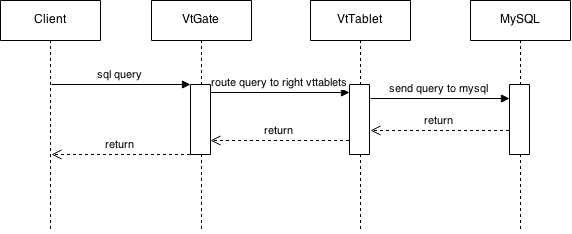
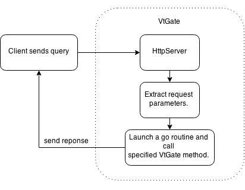
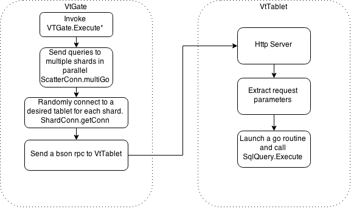
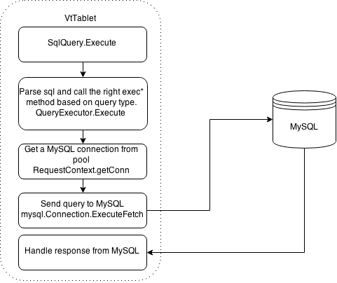
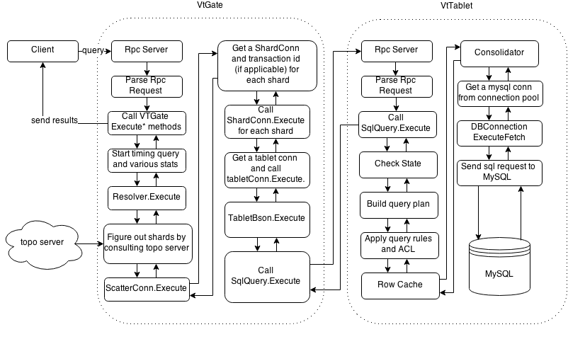

Life of A Query
=====================

* [From Client to VtGate](#from-client-to-vtgate)
* [From VtGate to VtTablet](#from-vtgate-to-vttablet)
* [From VtTablet to MySQL](#from-vttablet-to-mysql)
* [Put it all together](#put-it-all-together)
* [TopoServer](#toposerver)
* [Streaming Query](#streaming-query)
* [Scatter Query](#scatter-query)
* [Misc](#misc)
    * [Rpc Server Code Path (VtGate)](#rpc-server-code-path-vtgate)
    * [VtGate to VtTablet Code Path](#vtgate-to-vttablet-code-path)
    * [VtTablet to MySQL Code Path](#vttablet-to-mysql-code-path)

A query means a request for information from database and it involves four componenets in the case of Vitess, including client application, VtGate, VtTablet and MySQL instance. This doc explains interaction happens between and within components.



At a very high level, as the graph shows, first client sends a query to VtGate. VtGate then resolves the query and routes it to the right VtTablets. For each VtTablet that receives the query, it does necessary validations and passes the query to underlying MySQL instance. After gathering results from MySQL, VtTablet sends response back to VtGate. Once VtGate receives response from all VtTablets, it sends the combined result to client. In the presence of VtTablet errors, VtGate will retry the query if errors are recoverable and it only fails the query if either errors are unrecoverable or maximum retry times has been reached.

## From Client to VtGate

A client application first sends a bson rpc with an embedded sql query to VtGate. VtGate's rpc server unmarshals this rpc request, call appropriate VtGate method and return its result back to client. As following graph shows, VtGate has a rpc server that listens to localhost:port/\_bson\_rpc\_ for http requests and localhost:port/\_bson\_rpc\_/auth for https requests.



VtGate keeps an in-memory table that stores all available rpc methods for each service, e.g. VtGate uses "VTGate" as its service name and most its methods defined in [go/vt/vtgate/vtgate.go](../go/vt/vtgate/vtgate.go) are used to serve rpc request [go/rpcplus/server.go](../go/rpcplus/server.go).

## From VtGate to VtTablet



After receiving a rpc call from client and one of its Execute* method being invoked, VtGate needs to figure out which shards should receive the query and send query to each of them. In addition, VtGate talks to topo server to get necessary information to create a VtTablet connection for each shard. At this point, VtGate is able to send query to the right VtTablets in parallel. VtGate also does retry if timeout happens or some VtTablets return recoverable errors.

Internally, VtGate has a ScatterConn instance and uses it to execute queries across multiple ShardConn connections. A ScatterConn performs the query on selected shards in parallel. It first obtains a ShardConn connection for every shard and sends query use ShardConn's execute method. If the requested session is in a transaction, it will open a new transactions on the connection, and updates the Session with the transaction id. If the session already contains a transaction id for the shard, it reuses it. If there are any unrecoverable errors during a transaction, it rolls back the transaction for all shards.

A ShardConn object represents a load balanced connection to a group of VtTablets that belong the same shard. ShardConn can be concurrently used across goroutines.

## From VtTablet to MySQL



Once received a rpc call from VtGate, VtTablet do a few checks before passing query to MySQL. It first validates the current VtTablet state including sessions id, then generates a query plan and applies predefined query rules and do ACL check. It also checks whether the query hits row cache and returns result immediately if so. In addition, VtTablet consolidates duplicate queries from executing simultaneously and shares results between them. At this point, VtTablet has no way but pass the query down to MySQL layer and waits for the result.

## Put it all together



## TopoServer

A topo server stores information to help VtGate navigate query to the right VtTablets. It contains keyspace to shards mappings, keyspace id to shard mapping and ports that a VtTablet listens to (EndPoint). VtGates caches those information in the memory and periodically do updates if there are changes happened in the topo server.

## Streaming Query

In general speaking, a streaming query means query results will be returned as a stream. In Vitess's case, both VtGate and VtTablet will send result back as soon as it is available. VtTablet by default will collect a fixed number of rows returned from MySQL, send them back to VtGate and repeats the above step until all rows have been returned.

## Scatter Query

A scatter query, as its name indicates, will hit multiple shards. In Vitess, a scatter query is recognized once VtGate determines a query need to hit multiple VtTablets. VtGate then sends query to these VtTablets, assembles the result after receiving all response and returns the combined result to the client.

## Misc

### Rpc Server Code Path (VtGate)

Init a rpc server

```
go/cmd/vtgate/vtgate.go: main()  ->
  go/vt/servenv/servenv.go: RunDefault() -> // use the port specified in command line "--port"
    go/vt/servenv/run.go: Run(port int)  ->
      go/vt/servenv/rpc.go: ServeRPC()  -> // set up rpc server
        go/rpcwrap/bsonrpc/codec.go: ServeRPC()  -> // set up bson rpc server
          go/rpcwrap/rpcwrap.go: ServeRPC("bson", NewServerCodec)  -> // common code to register rpc server
```

ServeRPC("bson", NewServerCodec) register a rpcHandler instance whose ServeHTTP(http.ResponseWriter, *http.Request) will be called for every http request

Rpc server handle http request

```
go/rpcwrap/rpcwrap.go rpcHandler.ServeHTTP ->
go/rpcwrap/rpcwrap.go rpcHandler.server.ServeCodecWithContext ->
go/rpcplus/server.go Server.ServeCodecWithContext(context.Context, ServerCodec) (note: rpcHandler uses a global DefaultServer instance defined in the sever.go) ->
go/rpcplus/server.go Server.readRequest(ServeCodec) will use a given codec to extract (service, methodType, request, request arguments, reply value, keep reading), go/rpcplus/server.go
Finally we do "service.call(..)" with parameters provided in the request. In the current setup, service.call will always call some method in VtGate (go/vt/vtgate/vtgate.go).
```

### VtGate to VtTablet Code Path

Here is the code path for a query with keyspace id.

```
go/vt/vtgate/vtgate.go VTGate.ExecuteKeyspaceIds(context.Context, *proto.KeyspaceIdQuery, *proto.QueryResult) ->
  go/vt/vtgate/resolver.go resolver.ExecuteKeyspaceIds(context.Context, *proto.KeyspaceIdQuery) ->
    go/vt/vtgate/resolver.go resolver.Execute ->
      go/vt/vtgate/scatter_conn.go ScatterConn.Execute ->
        go/vt/vtgate/scatter_conn.go ScatterConn.multiGo ->
          go/vt/vtgate/scatter_conn.go ScatterConn.getConnection ->
          go/vt/vtgate/shard_conn.go ShardConn.Execute ->
            go/vt/vtgate/shard_conn.go ShardConn.withRetry ->
              go/vt/vtgate/shard_conn.go ShardConn.getConn ->
              go/vt/tabletserver/tabletconn/tablet_conn.go tabletconn.GetDialer ->
              go/vt/tabletserver/tabletconn/tablet_conn.go tabletconn.TabletConn.Execute ->
              go/vt/tabletserver/gorpctabletconn/conn.go TabletBson.Execute ->
                go/vt/tabletserver/gorpctabletconn/conn.go TabletBson.rpcClient.Call ->
                go/rpcplus/client.go rpcplus.Client.Call ->
                  go/rpcplus/client.go rpcplus.Client.Go ->
                    go/rpcplus/client.go rpcplus.Client.send
```

### VtTablet to MySQL Code Path

Here is the code path for a select query.

```
go/vt/tabletserver/sqlquery.go SqlQuery.Execute ->
go/vt/tabletserver/query_executor.go QueryExecutor.Execute ->
go/vt/tabletserver/query_executor.go QueryExecutor.execSelect ->
go/vt/tabletserver/request_context.go RequestContext.getConn -> // QueryExecutor composes a RequestContext
go/vt/tabletserver/request_context.go RequestContext.fullFetch ->
go/vt/tabletserver/request_context.go RequestContext.execSQL ->
go/vt/tabletserver/request_context.go RequestContext.execSQLNoPanic ->
go/vt/tabletserver/request_context.go RequestContext.execSQLOnce ->
go/vt/dbconnpool/connection_pool.go PoolConnection.ExecuteFetch (current implementation is in DBConnection) ->
go/vt/dbconnpool/connection.go PooledConnection.DBConnection.ExecuteFetch ->
go/mysql/mysql.go mysql.Connection.ExecuteFetch ->
go/mysql/mysql.go mysql.Connection.fetchAll
```
