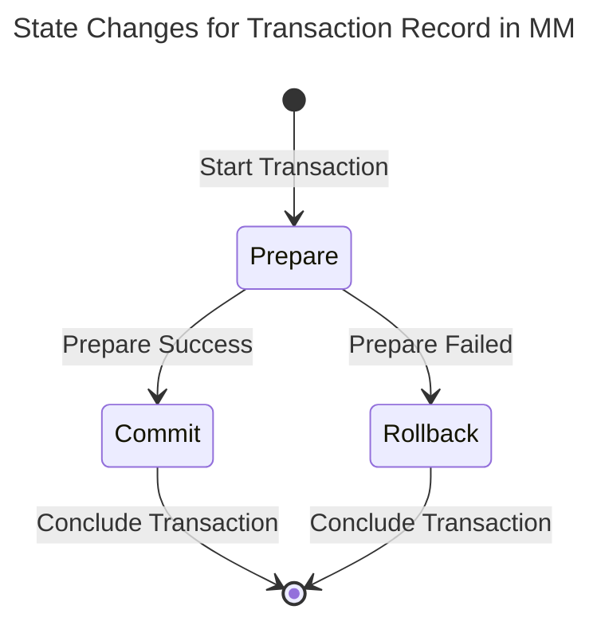
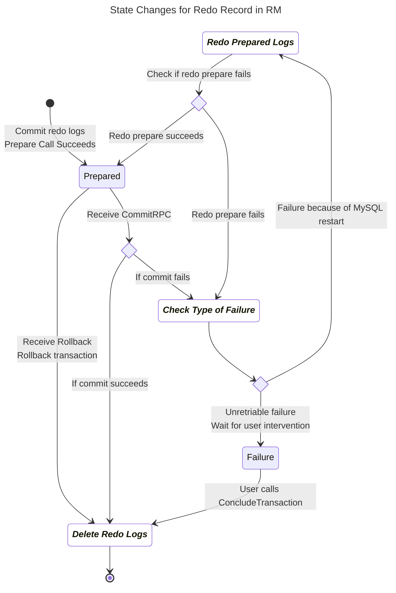
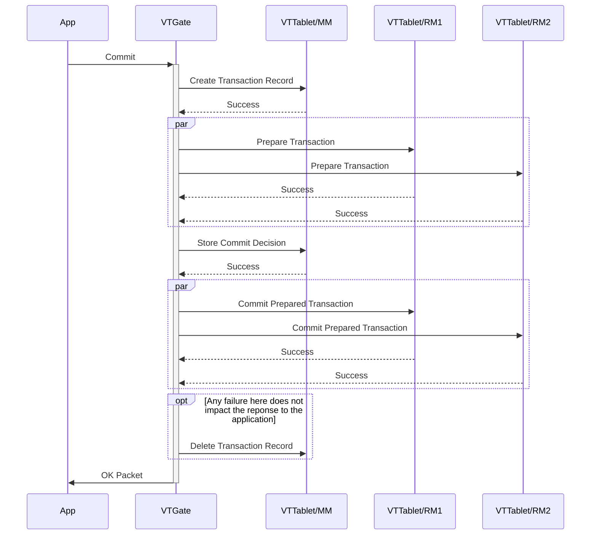
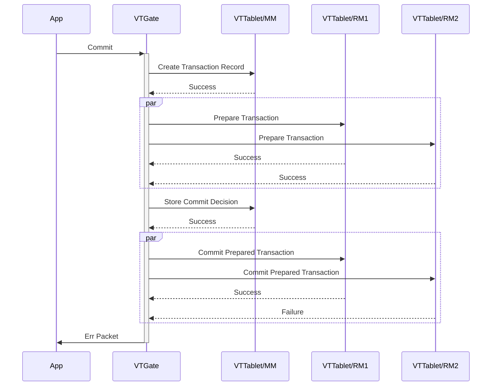
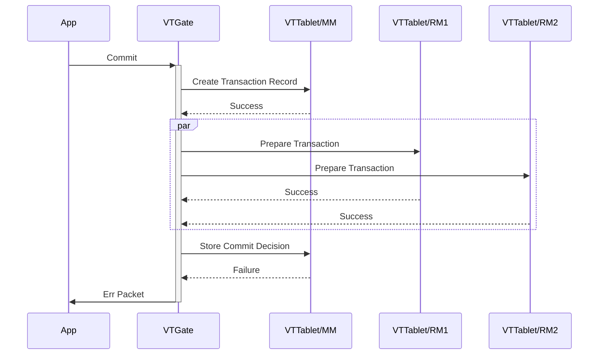
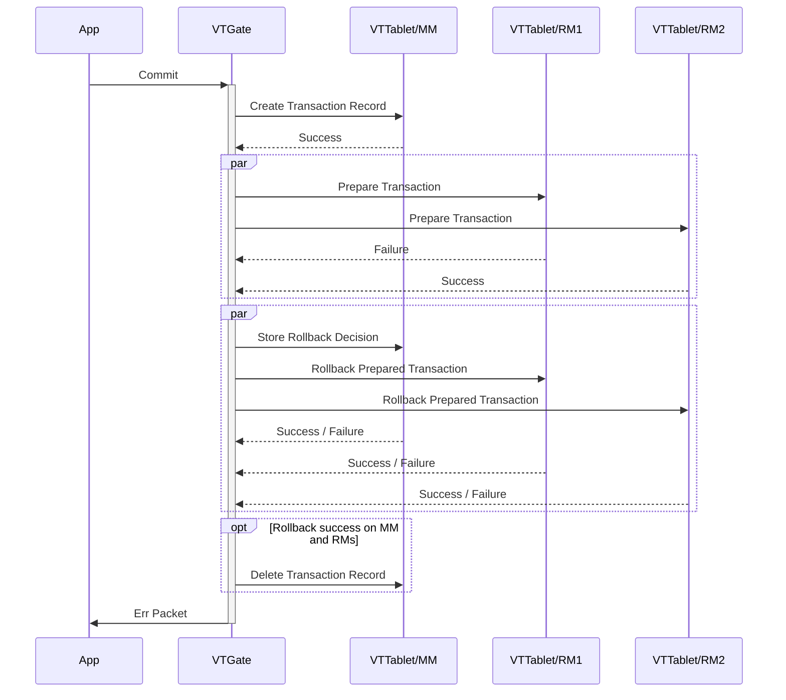
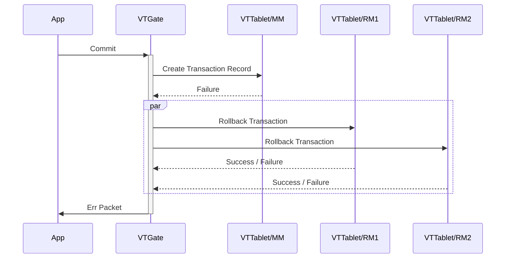
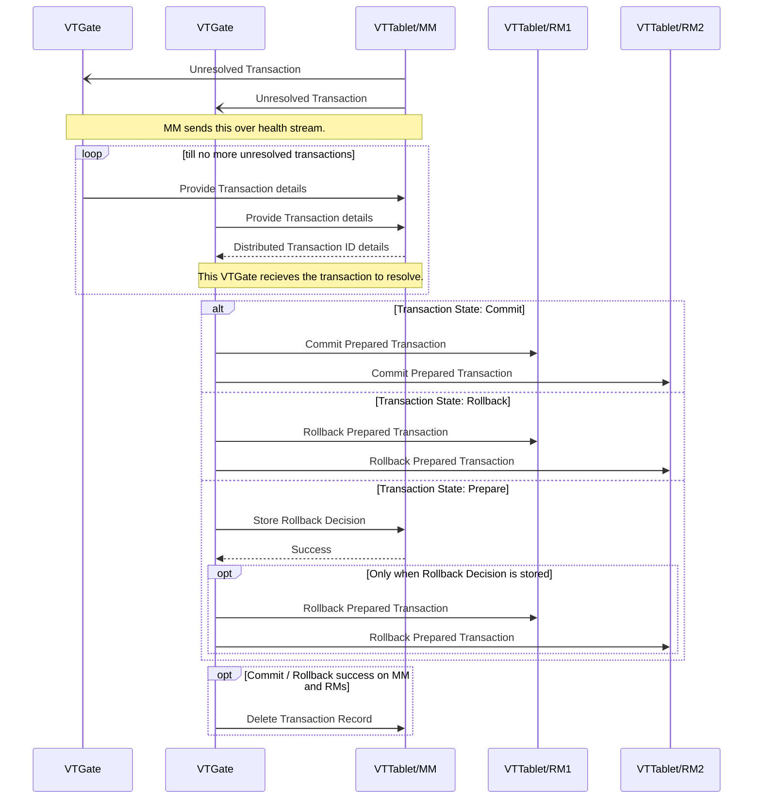

# Design Document: Atomic Distributed Transaction

# Objective

Provide a mechanism to support atomic commits for distributed transactions across multiple Vitess databases. Transactions should either complete successfully or rollback completely.

# Background

Vitess distributed transactions have so far been Best Effort Commit (BEC). An application is allowed to send DMLs that go to different shards or keyspaces in a single transaction. When a commit is issued, Vitess tries to individually commit each db transaction that was initiated. However, if a database goes down in the middle of a commit, that part of the transaction is lost. Moreover, with the support of lookup vindexes, VTGates could themselves open distributed transactions from single statements issued by the app.

Two Phase Commit (2PC) is the de facto protocol for atomically committing distributed transactions. Unfortunately, this has been considered impractical, and has predominantly failed in the industry. There are a few reasons:

* A database that goes down in the middle of a 2PC commit would hold transactions in other databases hostage till it was recovered. This is now a solved problem due to replication and fast failovers.
* The ACID requirements of relational databases were too demanding and contentious for a pure implementation to practically scale.
* The industry standard distributed transaction protocol (XA) overreached on flexibility and became too chatty.
* Subpar schemes for transaction management: Some added too much additional overhead, and some paid lip service and defeated the reliability of 2PC.

This document intends to address the above concerns with some practical trade-offs.

Although MySQL supports the XA protocol, it’s been unusable due to bugs. There have been multiple fixes made on 8.0, but still there are many open bugs. Also, it's usage in production is hardly known.

The most critical component of the 2PC protocol is the `Prepare` functionality. There is actually a way to implement Prepare on top of a transactional system. This is explained in a [Vitess Blog](https://vitess.io/blog/2016-06-07-distributed-transactions-in-vitess/), which will be used as foundation for this design.

Familiarity with the blog and the [2PC algorithm](http://c2.com/cgi/wiki?TwoPhaseCommit) are required to understand the rest of the document.

# Overview

Vitess will add a few variations to the traditional 2PC algorithm:

* There is a presumption that the Resource Managers (aka participants) must know upfront that they are involved in a 2PC transaction. Many APIs force the application to make this choice at the beginning of a transaction, but this is not actually required. In the case of Vitess, a distributed transaction will start off as usual, with a normal Begin. It will be converted only if the application requests a 2PC commit. This approach allows optimization of some common use cases.
* The 2PC algorithm does not specify how the Transaction Manager maintains the metadata. If you work through all the failure modes, it becomes evident that the manager must also be a highly available (HA) transactional system that survives failures without data loss. Since the VTTablets are already built to be HA, there’s no reason to build yet another system. So, we will split the role of the Transaction Manager into two:
  -   The Coordinator will be stateless and will orchestrate the work. VTGates are the perfect fit for this role.
  -   One of the VTTablets will be designated as the Metadata Manager (MM). It will store the metadata and perform the necessary state transitions.
* If we designate one of the participant VTTablets to be the MM, that database can avoid the prepare phase. If you assume there are N participants, the typical process is to perform prepares from 1 to N, followed by commits from 1 to N. Instead, we could go from 1->N for prepare, and N->1 for commit. Then, the Nth database would perform a Prepare->Decide to Commit->Commit. Instead, we execute the DML needed to transition the metadata state to "Decide to Commit" as part of the app transaction and commit it. If the commit fails, it is treated as the prepare having failed. If the commit succeeds, it is treated as all three operations having succeeded.
* The Prepare functionality will be implemented as explained in the [blog](https://vitess.io/blog/2016-06-07-distributed-transactions-in-vitess/).

Combining the above changes allows us to keep the most common use case efficient. A transaction that affects only one database incurs no additional cost due to 2PC.

In the case of multi-database transactions, we can choose the participant with the highest number of statements to be the MM. That database will not incur the cost of going through the Prepare phase, and we also avoid requiring a separate transaction to persist the commit decision.

## ACID trade-offs

The core 2PC algorithm only guarantees Atomicity: either the entire transaction commits, or it’s rolled back completely.

Consistency is an orthogonal property because it primarily ensures that the values in the database do not violate relational rules.

Durability is guaranteed by each database, and the collective durability is inherited by the 2PC process.

Isolation requires additional work. If a client tries to read data in the middle of a distributed commit, it could see partial commits. To prevent this, databases place read locks on rows involved in a 2PC. Consequently, anyone attempting to read them must wait until the transaction is resolved. This type of locking is so contentious that it often defeats the purpose of distributing the data.

In reality, this level of Isolation guarantee is overkill for most application code paths. Therefore, it is more practical to relax this for the sake of scalability and allow the application to use explicit locks where it deems better Isolation is required.

On the other hand, Atomicity is critical. Non-atomic transactions can result in partial commits, effectively corrupting the data. As mentioned earlier, Atomicity is guaranteed by 2PC.

# Life of a 2PC transaction

* The application issues a Begin to VTGate. At this time, the session is updated to indicate that it’s in a transaction.
* The application sends DMLs to VTGate. As these DMLs are received, VTGate starts transactions against various VTTablets. The transaction id for each VTTablet (VTID) is stored in the session.
* The application requests a 2PC commit. Until this point, there is no difference between a BEC and a 2PC. In the case of BEC, VTGate just sends the commit to all participating VTTablets. For 2PC, VTGate initiates and executes the workflow described in the subsequent steps.

## Prepare

* Generate a Distributed Transaction Identifier (DTID).
* The VTTablet at the first position in the session transaction list is singled out as the MM. To this VTTablet, issue a CreateTransaction command with the DTID. This information will be monitored by the transaction resolution watcher.
* Issue a Prepare to all other VTTablets. Send the DTID as part of the prepare request.

## Commit

* Execute the 3-in-1 action of Prepare->Decide->Commit (StartCommit) for the MM VTTablet. This will change the metadata state to ‘Commit’.
* Issue a CommitPrepared commands to all the prepared VTTablets using the DTID.
* Delete the transaction in the MM with ConcludeTransaction.

## Rollback

Any form of failure until the point of saving the commit decision will result in a decision to rollback.

* Transition the metadata state to ‘Rollback’.
* Issue RollbackPrepared commands to the prepared transactions using the DTID.
* If the original VTGate is still orchestrating, rollback the unprepared transactions using their VTIDs. Otherwise, any unprepared transactions will be rolled back by the transaction killer.
* Delete the transaction in the MM with ConcludeTransaction.

## Transaction Resolution Watcher

A Transaction Resolution watcher will kick in if a transaction remains unresolved for too long in the MM. If such a transaction is found, it will be in one of three states:

1. Prepare
2. Rollback
3. Commit

For #1 and #2, the Rollback workflow is initiated. For #3, the commit workflow is resumed.

The following diagrams illustrates the life-cycle of a 2PC transaction in Metadata Manager (MM) and Resource Manager  (RM).





A transaction generally begins as a single DB transaction, and a 2PC commit on a single DB transaction is treated as a normal commit. A transaction becomes a distributed transaction as soon as more than one VTTablet is involved. If an app issues a rollback, all participants are simply rolled back.  
A 2PC commit on a distributed transaction initiates the new commit flow. The transaction record is stored in the 'Prepare' state and remains so while Prepares are issued to the RMs.  
If the Prepares are successful, the state transitions to 'Commit'. In the Commit state, only commits are allowed. By the guarantee provided by the Prepare contract, all databases will eventually accept the commits.  
Any failure during the Prepare state results in the state transitioning to 'Rollback'. In this state, only rollbacks are allowed.
# Component interactions

Any error in the commit phase is indicated to the application with a warning flag. If an application's transaction receives a warning signal, it can execute a `show warnings` to know the distributed transaction ID for that transaction. It can watch the transaction status with `show transaction status for <dtid>`.

Case 1: All components respond with success.


Case 2: When the Commit Prepared Transaction from the RM responds with an error. In this case, the watcher service needs to resolve the transaction and commit the pending prepared transactions.


Case 3: When the Commit Decision from MM responds with an error. In this case, the watcher service needs to resolve the transaction as it is not certain whether the commit decision persisted or not.


Case 4: When a Prepare Transaction fails. TM will decide to roll back the transaction. If any rollback returns a failure, the watcher service will resolve the transaction.


Case 5: When Create Transaction Record fails. TM will roll back the transaction.


## Transaction Resolution Watcher



# Detailed Design

The detailed design explains all the functionalities and interactions.

## DTID generation

Currently, transaction ids are issued by VTTablets (VTID), and those ids are considered local. 
In order to coordinate distributed transactions, a new system is needed to identify and track them. 
This is needed mainly so that the watchdog process can pick up an orphaned transaction and resolve it to completion.

The DTID will be generated by taking the VTID of the MM and prefixing it with the keyspace and shard info to prevent collisions. 
If the MM’s VTID is ‘1234’ for keyspace ‘order’ and shard ‘40-80’, then the DTID will be ‘order:40-80:1234’. 
A collision could still happen if there is a failover and the new VTTablet’s starting VTID had overlaps with the previous instance. 
To prevent this, the starting VTID of the VTTablet will be adjusted to a value higher than any used by the prepared DTIDs.

## Prepare API

The Prepare API will be provided by VTTablet, and will follow the guidelines of the [blog](https://vitess.io/blog/2016-06-07-distributed-transactions-in-vitess/). 
It’s essentially three functions: Prepare, CommitPrepared and RollbackPrepared.

### Statement list and state

Every transaction will have to remember its DML statement list. VTTablet already records queries against each transaction (RecordQuery). 
However, it’s currently the original queries of the request. This has to be changed to the DMLs that are sent to the database.
The current RecordQuery functionality is mainly for troubleshooting and diagnostics. So, it’s not very material if we changed it to record actual DMLs. It would remain equally useful.

### Schema

The tables will be in the sidecar database. All timestamps are represented as unix nanoseconds.

The redo_state table needs to support the following use cases:

* Prepare: Create row.
* Recover & repair tool: Fetch all transactions: full joined table scan.
* Resolve: Transition state for a DTID: update where dtid = :dtid and state = :prepared.
* Watchdog: Count unresolved transactions that are older than X: select where time_created < X.
* Delete a resolved transaction: delete where dtid = :dtid.

```
create table redo_state(
  dtid varbinary(512),
  state bigint, // state can be 0: Failed, 1: Prepared.
  time_created bigint,
  message text, // record any error message.
  primary key(dtid)
)
```

The redo_statement table is a detail of redo_log_transaction table. 
It needs the ability to read the statements of a dtid in the correct order (by id), and the ability to delete all statements for a given dtid.

```
create table redo_statement(
  dtid varbinary(512),
  id bigint,
  statement mediumblob,
  primary key(dtid, id)
)
```

### Prepare

This function is proposed to take a DTID and a VTID as input.

* The function will retrieve the active transaction connection and move it to the prepared pool. If the prepared pool is full, the transaction will be rolled back, and an error will be returned.
* Metadata will be saved to the redo logs as a separate transaction. If this step fails, the main transaction will also be rolled back, and an error will be returned.

If VTTablet is being shut down or transitioned to a non-primary, the transaction pool handler will internally, rollback the prepared transactions and return them to the transaction pool. 
The rollback of prepared transactions must happen only after all the open transactions are resolved (rollback or commited). 
If a pending transaction is waiting on a lock held by a prepared transaction, it will eventually time out and get rolled back.

Eventually, a different VTTablet will be transitioned to become the primary. At that point, it will recreate the unresolved transactions from redo logs. 
If the replays fail, we’ll raise an alert and start the query service anyway. Typically, a replay is not expected to fail because VTTablet does not allow writing to the database until the replays are done. Also, no external agent should be allowed to perform writes to MySQL, which is a loosely enforced Vitess requirement. Other vitess processes do write to MySQL directly, but they’re not the kind that interfere with the normal flow of transactions.

VTTablet always execute DMLs with BEGIN-COMMIT. This will ensure that no autocommit statements can slip through if connections are inadvertently closed out of sequence.

### CommitPrepared

This function commits the prepared transaction for the given DTID.

* Extract the transaction from the Prepare pool.
  * If transaction is in the failed pool, return an error.
  * If the transaction is not found, return success (it was already resolved).
* As part of the current transaction, transition the state in redo_log to Committed and commit the transaction.
  * On failure, log the error message in redo_state and move it to the failed pool for non-retryable error. Subsequent commits will permanently fail.
* Return the connection to the transaction pool.

### RollbackPrepared

This function rolls back the prepared/un-prepared transaction for the given DTID and VTID.

* Delete the redo log entries for the dtid in a separate transaction.
* Extract the transaction from the Prepare pool.
  * If present, rollback and return the connection to the transaction pool.
* If VTID is provided, rollback the original transaction.

## Metadata Manager API

The MM functionality is provided by VTTablet. This could be implemented as a separate service, but designating one of the 
participants to act as the manager gives us some optimization opportunities. 
The supported functions are CreateTransaction, StartCommit, SetRollback, and ConcludeTransaction.

### Schema

The transaction metadata will consist of two tables. It will need to fulfil the following use cases:

* CreateTransaction: Store transaction record metadata.
* Transition state: update where dtid = :dtid and state = :prepare.
* Resolve flow: select dt_state & dt_participant where dtid = :dtid.
* Transaction Resolver Watcher: full table scan where time_created < X.
* Delete a resolved transaction: delete where dtid = :dtid.

```
create table dt_state(
  dtid varbinary(512),
  state bigint, // state PREPARE, COMMIT, ROLLBACK
  time_created bigint,
  primary key(dtid),
  key (time_created)
)
```

```
create table dt_participant(
  dtid varbinary(512),
  id bigint,
  keyspace varchar(256),
  shard varchar(256),
  primary key (dtid, id)
)
```

### CreateTransaction

This function stores the transaction metadata record. The initial state will be `PREPARE`. 
A successful create starts the 2PC process. This will be followed by VTGate issuing prepares to the rest of the participants.

### StartCommit

This function will be called when transaction coordinator have taken a `COMMIT` decision.
A transaction resolution on recovery cannot will not make a `StartCommit` call. So, we can assume the original transaction VTID for this VTTablet is still active.

* Extract the connection for the given VTID.
* Update the transaction state from PREPARE to COMMIT as part of the participant’s transaction (VTID).
* Issue a commit and release the transaction back to transaction pool.

If successful, VTGate will execute the commit decision on rest of the participants.
If not successful, VTGate at this point will leave the transaction resolution to the watcher.

### SetRollback

This function transitions the state from PREPARE to ROLLBACK using an independent transaction. 
When this function is called, the MM’s transaction (VTID) may still be alive. 
So, it infers the transaction id from the dtid and perform the best effort rollback. 
If the transaction is not found, it’s a no-op.

### ConcludeTransaction

This function removes the transaction metadata record for the given DTID.

### ReadTransaction

This function returns the transaction metadata for the given DTID.

### UnresolvedTransactions

This function returns all unresolved transaction metadata older than certain age either provided in the request or the default set on the VTTablet.

### ReadTwopcInflight

This function returns all transaction metadata and the redo statement log.

## Transaction Coordinator

VTGate is already responsible for Best Effort Commit, aka `transaction_mode=MULTI`, it can naturally be extended to act as the coordinator for 2PC. 
It needs to support commit with `transaction_mode=twopc`.

VTGate also has to listen on the VTTablet health stream to receive unresolved transaction signals and act on them to resolve them.

### Commit(transaction_mode=twopc)

This call is issued on an active transaction, whose Session info is known. The function will perform the workflow described in the life of a transaction:

* Identify a VTTablet as MM, and generate a DTID based on the identity of the MM.
* CreateTransaction on the MM
* Prepare on all other participants
* StartCommit on the MM
* CommitPrepared on all other participants
* ResolveTransaction on the MM

Any failure before StartCommit will trigger the rollback workflow:

* SetRollback on the MM
* RollbackPrepared on all participants for which Prepare was sent
* Rollback on all other participants
* ResolveTransaction on the MM

### Unresolved Transaction Signal

This signal is received by VTGate from MM when there are unresolved transactions.

The function starts off with calling UnresolvedTransactions on the VTTablet to read the transaction metadata.
Based on the state, it performs the following actions:

* Prepare: SetRollback and initiate rollback workflow. 
* Rollback: Initiate rollback workflow.
* Commit: Initiate commit workflow.

Commit workflow:

* CommitPrepared on all participants.
* ResolveTransaction on the MM

Rollback workflow:

* RollbackPrepared on all participants.
* ResolveTransaction on the MM.

## Transaction Resolution Watcher

The stateless VTGates are considered ephemeral and can fail at any time, which means that transactions could be abandoned in the middle of a distributed commit. 
To mitigate this, every primary VTTablet will poll its dt_state table for distributed transactions that are lingering. 
If any such transaction is found, it will signal this to VTGate via health stream to resolve them.

## Client API

The client have to modify the `transaction_mode`. 
Default is `Multi`, they would need to set to `twopc` either as a VTGate flag or on the session with `SET` statement.

# Production support

Beyond the functionality, additional work is needed to make 2PC viable for production. 
The areas of concern are disruptions, monitoring, tooling and configuration.

# Disruptions

The atomic transactions should be resilient to the disruptions. Let us cover the different disruptions that can happen in a running cluster and how atomic transactions are engineered to handle them without breaking the Atomicity guarantee.

### `PlannedReparentShard` and `EmergencyReparentShard`

For both Planned and Emergency reparents, we call `DemotePrimary` on the primary tablet. For Planned reparent, this call has to succeed, while on Emergency reparent, if the primary is unreachable then this call can fail, and we would still proceed further.

As part of the `DemotePrimary` flow, when we transition the tablet to a non-serving state, we wait for all the transactions to have completed (in `TxEngine.shutdownLocked()` we have `te.txPool.WaitForEmpty()`). If the user has specified a shutdown grace-period, then after that much time elapses, we go ahead and forcefully kill all running queries. We then also rollback the prepared transactions. It is crucial that we rollback the prepared transactions only after all other writes have been killed, because when we rollback a prepared transaction, it lets go of the locks it was holding. If there were some other conflicting write in progress that hadn't been killed, then it could potentially go through and cause data corruption since we won't be able to prepare the transaction again. All the code to kill queries can be found in `stateManager.terminateAllQueries()`.

The above outlined steps ensure that we either wait for all prepared transactions to conclude or we rollback them safely so that they can be prepared again on the new primary.

On the new primary, when we call `PromoteReplica`, we redo all the prepared transactions before we allow any new writes to go through. This ensures that the new primary is in the same state as the old primary was before the reparent. The code for redoing the prepared transactions can be found in `TxEngine.RedoPreparedTransactions()`.

If everything goes as described above, there is no reason for redoing of prepared transactions to fail. But in case, something unexpected happens and preparing transactions fails, we still allow the VTTablet to accept new writes because we decided availability of the tablet is more important. We will however, build tooling and metrics for the users to be notified of these failures and let them handle this in the way they see fit.

While Planned reparent is an operation where all the processes are running fine, Emergency reparent is called when something has gone wrong with the cluster. Because we call `DemotePrimary` in parallel with `StopReplicationAndBuildStatusMap`, we can run into a case wherein the primary tries to write something to the binlog after all the replicas have stopped replicating. If we were to run without semi-sync, then the primary could potentially commit a prepared transaction, and return a success to the VTGate trying to commit this transaction. The VTGate can then conclude that the transaction is safe to conclude and remove all the metadata information. However, on the new primary since the transaction commit didn't get replicated, it would re-prepare the transaction and would wait for a coordinator to either commit or rollback it, but that would never happen. Essentially we would have a transaction stuck in prepared state on a shard indefinitely. To avoid this situation, it is essential that we run with semi-sync, because this ensures that any write that is acknowledged as a success to the caller, would necessarily have to be replicated to at least one replica. This ensures that the transaction would also already be committed on the new primary.

### MySQL Restarts

When MySQL restarts, it loses all the ongoing transactions which includes all the prepared transactions. This is because the transaction logs are not persistent across restarts. This is a MySQL limitation and there is no way to get around this. However, at the Vitess level we must ensure that we can commit the prepared transactions even in case of MySQL restarts without any failures.

Vttablet has the code to detect MySQL failures and call `stateManager.checkMySQL()` which transitions the tablet to a NotConnected state. This prevents any writes from going through until the VTTablet has transitioned back to a serving state.

However, we cannot rely on `checkMySQL` to ensure that no conflicting writes go through. This is because the time between MySQL restart and the VTTablet transitioning to a NotConnected state can be large. During this time, the VTTablet would still be accepting writes and some of them could potentially conflict with the prepared transactions.

To handle this, we rely on the fact that when MySQL restarts, it starts with super-read-only turned on. This means that no writes can go through. It is VTOrc that registers this as an issue and fixes it by calling `UndoDemotePrimary`. As part of that call, before we set MySQL to read-write, we ensure that all the prepared transactions are redone in the read_only state. We use the dba pool (that has admin permissions) to prepare the transactions. This is safe because we know that no conflicting writes can go through until we set MySQL to read-write. The code to set MySQL to read-write after redoing prepared transactions can be found in `TabletManager.redoPreparedTransactionsAndSetReadWrite()`.

Handling MySQL restarts is the only reason we needed to add the code to redo prepared transactions whenever MySQL transitions from super-read-only to read-write state. Even though, we only need to do this in `UndoDemotePrimary`, it not necessary that it is `UndoDemotePrimary` that sets MySQL to read-write. If the user notices that the tablet is in a read-only state before VTOrc has a chance to fix it, they can manually call `SetReadWrite` on the tablet.
Therefore, the safest option was to always check if we need to redo the prepared transactions whenever MySQL transitions from super-read-only to read-write state.

### VTTablet Restarts

When Vttabet restarts, all the previous connections are dropped. It starts in a non-serving state, and then after reading the shard and tablet records from the topo, it transitions to a serving state.
As part of this transition we need to ensure that we redo the prepared transactions before we start accepting any writes. This is done as part of the `TxEngine.transition` function when we transition to an `AcceptingReadWrite` state. We call the same code for redoing the prepared transactions that we called for MySQL restarts, PRS and ERS.

### VTGate Restarts

There is no additional work needed for VTGate restarts. The atomic transaction will resume based on the last known state in the MM based and will kick of the unresolved transaction workflow.

### Online DDL

During an Online DDL cutover, we need to ensure that all the prepared transactions on the online DDL table needs to be completed before we can proceed with the cutover.
This is because the cutover involves a schema change, and we cannot have any prepared transactions that are dependent on the old schema.

As part of the cut-over process, Online DDL adds query rules to buffer new queries on the table.
It then checks for any open prepared transaction on the table and waits for up to 100ms if found, then checks again.
If it finds no prepared transaction of the table, it moves forward with the cut-over, otherwise it fails. The Online DDL mechanism will later retry the cut-over.

In the Prepare code, we check the query rules before adding the transaction to the prepared list and re-check the rules before storing the transaction logs in the transaction redo table.
Any transaction that went past the first check will fail the second check if the cutover proceeds.

The check on both sides prevents either the cutover from proceeding or the transaction from being prepared.

### MoveTables

The only step of a `MoveTables` workflow that needs to synchronize with atomic transactions is `SwitchTraffic` for writes. As part of this step, we want to disallow writes to only the tables involved. We use `DeniedTables` in `ShardInfo` to accomplish this. After we update the topo server with the new `DeniedTables`, we make all the VTTablets refresh their topo to ensure that they've registered the change.

On VTTablet, the `DeniedTables` are used to add query rules very similar to the ones in Online DDL. The only difference is that in Online DDL, we buffer the queries, but for `SwitchTraffic` we fail them altogether. Addition of these query rules, prevents any new atomic transactions from being prepared.

Next, we try locking the tables to ensure no existing write is pending. This step blocks until all open prepared transactions have succeeded.

After this step, `SwitchTraffic` can proceed without any issues, since we are guaranteed to reject any new atomic transactions until the `DeniedTables` has been reset, and having acquired the table lock, we know no write is currently in progress.


## Monitoring

To facilitate monitoring, new metrics will be published.

### VTTablet

* The Transactions hierarchy will be extended to report CommitPrepared and RollbackPrepared stats, which includes histograms. Since Prepare is an intermediate step, it will not be rolled up in this variable.
* For Prepare, two new variables will be created:
  * Prepare histogram will report prepare timings.
  * PrepareStatements histogram will report the number of statements for each Prepare.
* `UnresolvedTransaction` is a gauge that reports current number of open unresolved transactions in `ResourceManager` or `MetadataManager`.
* Any CommitPrepared or RedoPrepared failure will raise the counter in respective `CommitPreparedFail` or `RedoPreparedFail` with retyable or non-retryable error. Alert should be raised for non-retryable error.
* Any unexpected errors during a 2PC will increment a counter for InternalErrors, which should already be set to raise an alert.

### VTGate

* Transactions will report Commit mode timing histogram `Single`, `Multi` and `TwoPC` for single shard, best-effort multi shard and 2PC multi shard transactions.
* 2PC transactions will report 
  * `CommitUnresolved` count on a failure after transactions is prepared on all RMs.
  * `Participant` count to determine the average number of shards involved in a multi shard transaction. 

## Tooling

On VTAdmin, `Transactions` tab will list all the unresolved TwoPC transactions. It will have option to change the abandon age time to limit the unresolved transactions older than the select time.
The current action that can be done on these transactions is `Conclude`. It will clear out the state in all the shards about the selected transaction.
Currently, the user have to take the corrective actions for the transactions that are lingering from long time and transaction resolver is not able to complete them.

# Data Guarantees

Although the above workflows are foolproof, they do rely on the data guarantees provided by the underlying systems and the fact that prepared transactions can get killed only together with VTTablet.
In all the scenarios below, there is as possibility of irrecoverable data loss. But the system needs to alert correctly, and we must be able to make the best effort recovery and move on. 
For now, these scenarios require operator intervention, but the system could be made to automatically perform these as we gain confidence.

## Prepared transaction gets killed

It is possible for an external agent to kill the connection of a prepared transaction. If this happened, MySQL will roll it back. If the system is serving live traffic, it may make forward progress in such a way that the transaction may not be replayable, or may replay with different outcome.
This is a very unlikely occurrence. But if something like this happen, then an alert will be raised when the coordinator finds that the transaction is missing. That transaction will be marked as Failed until an operator resolves it.
But if there’s a failover before the transaction is marked as failed, it will be resurrected over future transaction possibly with incorrect changes. A failure like this will be undetectable.

## Transaction Recovery Redo Reliability

The current implementation stores the transaction recovery logs as DML statements. 
On transaction recovery, while applying the statements from these logs it is not expected to fail as the current shutdown and startup workflow ensure that no other DMLs leak into the database. 
Still, there remains a risk of statement failure during the redo log application, potentially resulting in lost modifications without clear tracking of modified rows.
If something like this happen, then an alert will be raised which the operator have to look into. 

# Testing Plan

The main workflow of 2PC is fairly straightforward and easy to test. What makes it complicated are the failure modes. We will classify these tests into different tests.

## Basic Tests
Commit or rollback of transactions, and handling prepare failures leading to transaction rollbacks.

## Reliability tests
This test should run over an extended period, potentially lasting a few days or a week, and must endure various scenarios including:

* Failure of different components (e.g., VTGate, VTTablets, MySQL)
* Reparenting (PRS & ERS)
* Resharding
* Online DDL operations

### Fuzzy tests
A fuzzy test suite, running continuous stream of multi-shard transactions and expecting events to be in specific sequence on terminating the long-running test.

### Stress Tests
A continuous stream of transactions (single and distributed) will be executed, with all successful commits recorded along with the expected rows. 
The binary log events will be streamed continuously and validated against the ordering of the change stream and the successful transactions.


# Innovation
This design has a bunch of innovative ideas. However, it’s possible that they’ve been used before under other circumstances, or even 2PC itself. Here’s a summary of all the new ideas in this document, some with more merit than others:

* Moving away from the heavyweight XA standard.
* Implementing Prepare functionality on top of a system that does not inherently support it.
* Storing the Metadata in a transactional engine and making the coordinator stateless.
* Storing the Metadata with one of the participants and avoiding the cost of a Prepare for that participant.
* Choosing to relax Isolation guarantees while maintaining Atomicity.


# Future Enhancements

## Read Isolation Guarantee
The current system lacks isolation guarantees, placing the burden on the application to manage it. Implementing read isolation will enable true cross-shard ACID transactions.

## Distributed Deadlock Avoidance
The current system can encounter cross-shard deadlocks, which are only resolved when one of the transactions times out and is rolled back. Implementing distributed deadlock avoidance will address this issue more efficiently.

# Appendix

## Glossary

* Distributed Transaction: Any transaction that spans multiple databases is a distributed transaction. It does not imply any commit protocol.
* Best Effort Commit (BEC): This protocol is what’s currently supported by Vitess, where commits are sent to all participants. This could result in partial commits if there are failures during the process.
* Two-Phase Commit (2PC): This is the protocol that guarantees Atomic distributed commits.
* Coordinator: This is a stateless process that is responsible for initiating, resuming and completing a 2PC transaction. This role is fulfilled by the VTGates.
* Resource Manager (RM) aka Participant: Any database that’s involved in a distributed transaction. Only VTTablets can be participants.
* Metadata Manager (MM): The database responsible for storing the metadata and performing its state transitions. In Vitess, one of the participants will be designated as the MM.
* Watchdog: The watchdog looks for abandoned transactions and initiates the process to get them resolved.
* Distributed Transaction ID (DTID): A unique identifier for a 2PC transaction.
* VTTablet transaction id (VTID): This is the individual transaction ID for each VTTablet participant that contains the application’s statements to be committed/rolled back.
* Decision: This is the irreversible decision to either commit or rollback the transaction. Although confusing, this is also referred to as the ‘Commit Decision’. We’ll also indirectly refer to this as ‘Metadata state transition’. This is because a transaction undergoes many state changes. The Decision is a critical transition. So, it warrants its own name.

## Reworked Design
This design is updated based on the new work carried on the Atomic Distributed Transactions.
More details about the recent changes are present in the [RFC](https://github.com/vitessio/vitess/issues/16245).

## Exploratory Work
MySQL XA was considered as an alternative to having RMs manage the transaction recovery logs and hold up the row locks until a commit or rollback occurs.

There are currently over 20 open bugs on XA. On MySQL 8.0.33, reproduction steps were followed for all these bugs, and 8 still persist. Out of these 8 bugs, 4 have patches attached that resolve the issues when applied. 
For the remaining 4 issues, changes will need to be made either in the code or the workflow to ensure they are resolved.

MySQL’s XA seems a probable candidate if we encounter issues with our implementation of handling distributed transactions that XA can resolve. XA's chatty API and no known big production deployment have kept us away from using it.