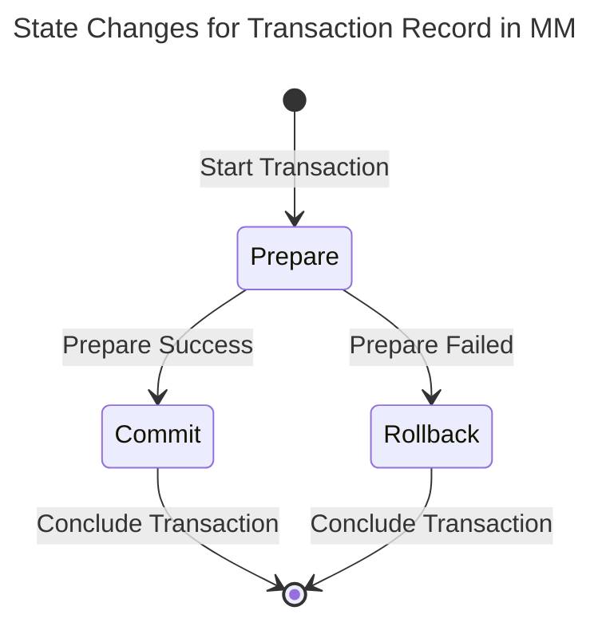
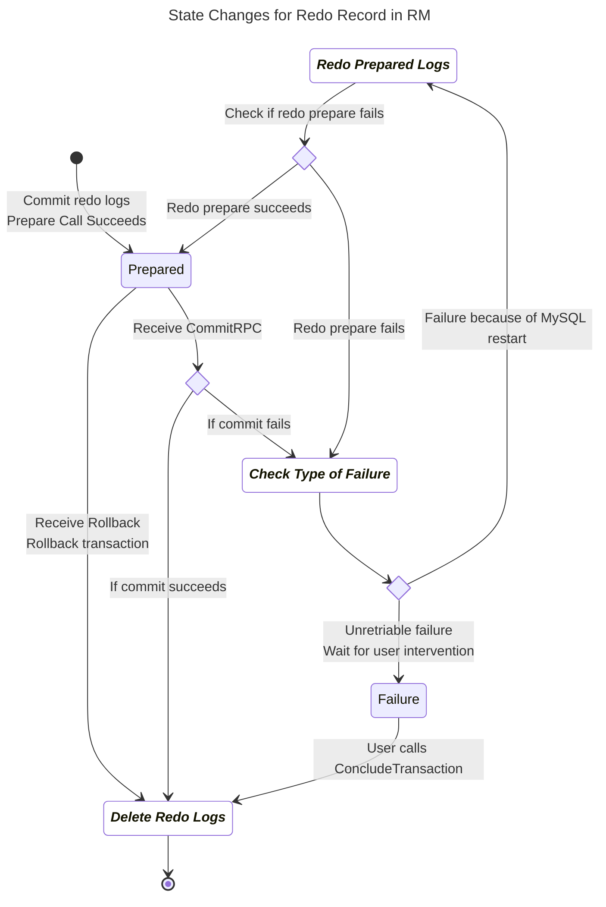
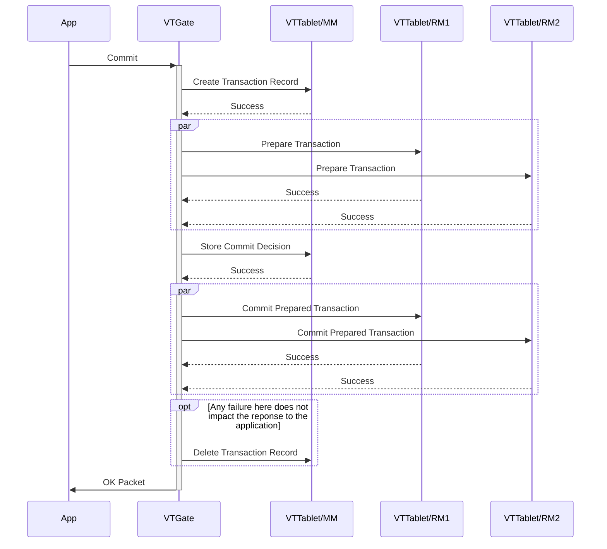
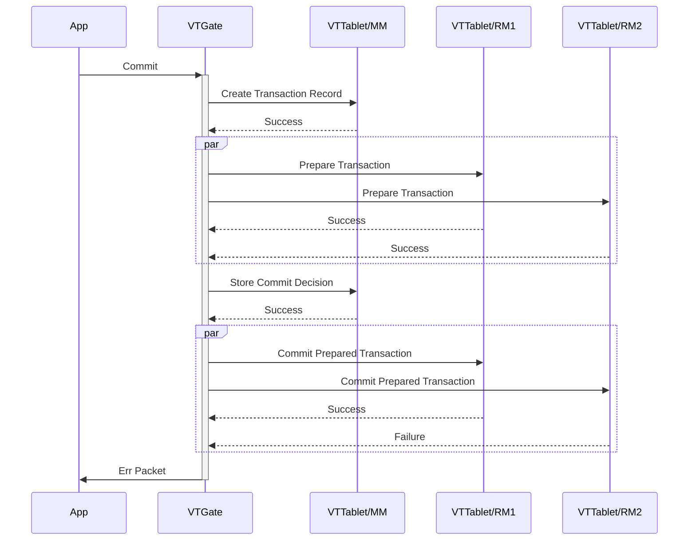
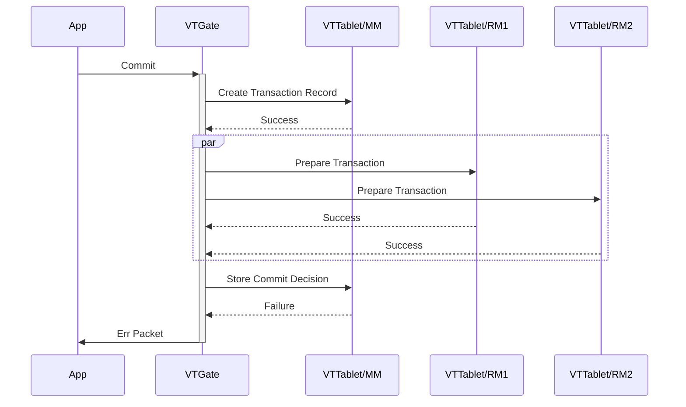
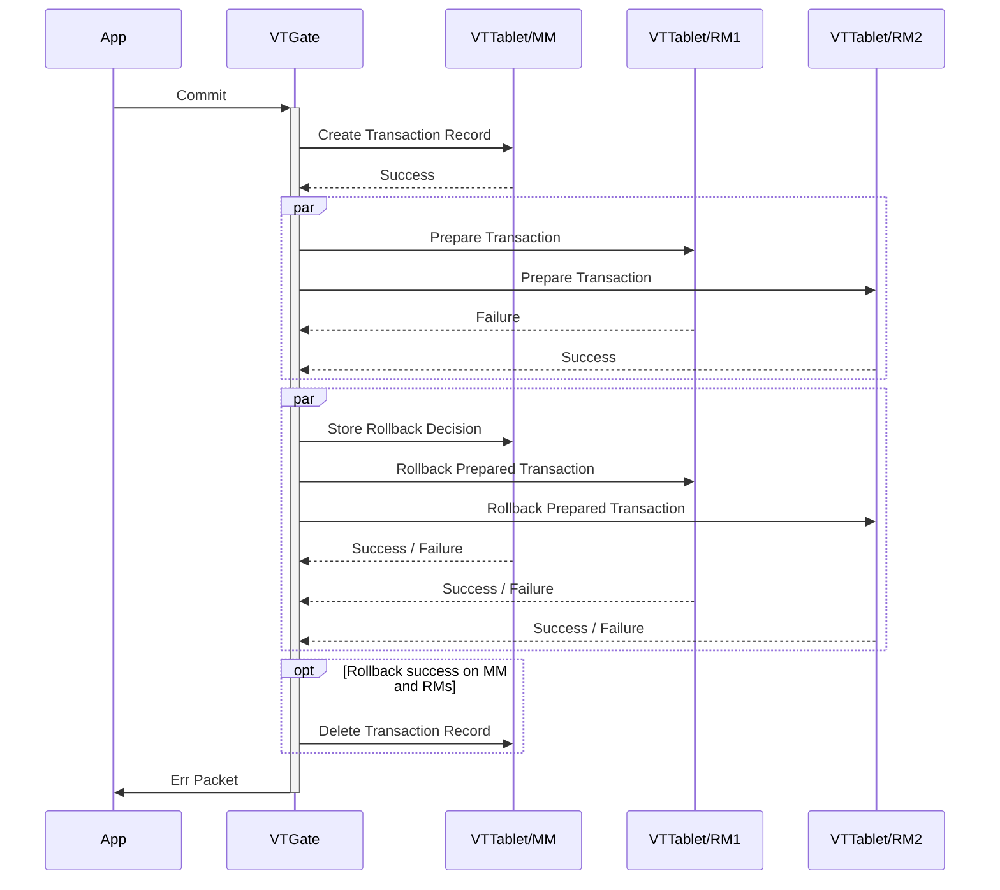
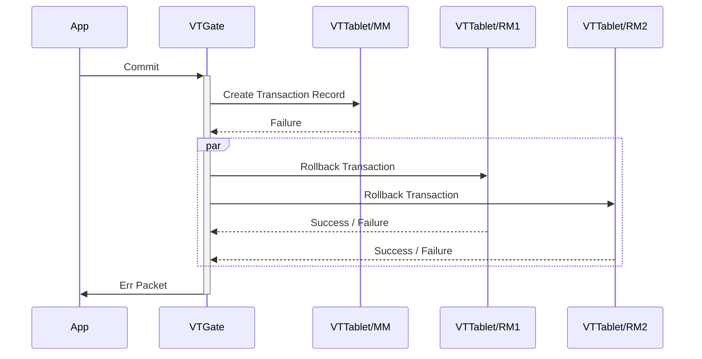
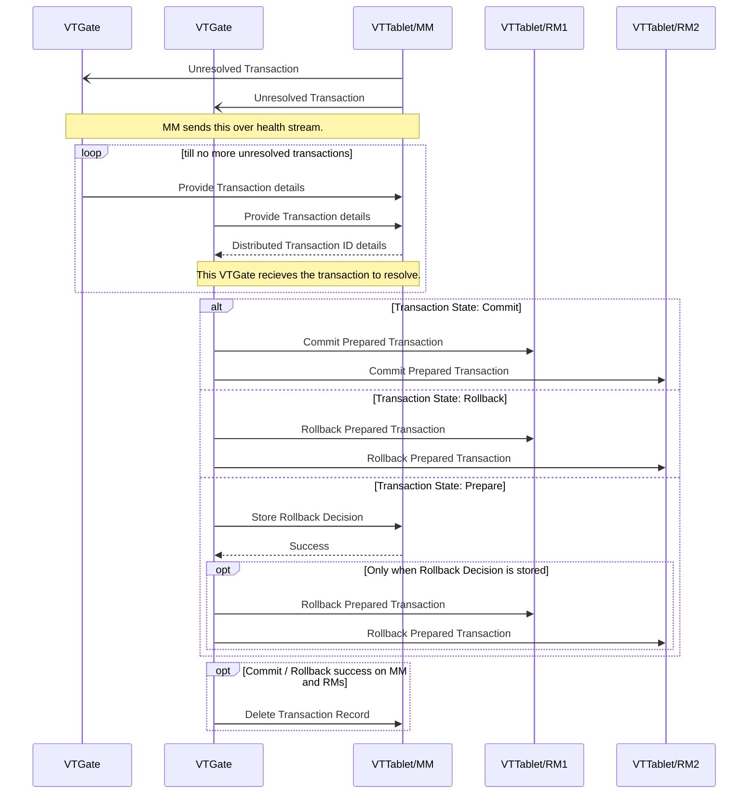

# Design Document: Atomic Distributed Transaction

# Objective

Provide a mechanism to support atomic commits for distributed transactions across multiple Vitess databases. Transactions should either complete successfully or rollback completely.

# Background

Vitess distributed transactions have so far been Best Effort Commit (BEC). An application is allowed to send DMLs that go to different shards or keyspaces in a single transaction. When a commit is issued, Vitess tries to individually commit each db transaction that was initiated. However, if a database goes down in the middle of a commit, that part of the transaction is lost. Moreover, with the support of lookup vindexes, VTGates could themselves open distributed transactions from single statements issued by the app.

Two Phase Commit (2PC) is the de facto protocol for atomically committing distributed transactions. Unfortunately, this has been considered impractical, and has predominantly failed in the industry. There are a few reasons:

* A database that goes down in the middle of a 2PC commit would hold transactions in other databases hostage till it was recovered. This is now a solved problem due to replication and fast failovers.
* The ACID requirements of relational databases were too demanding and contentious for a pure implementation to practically scale.
* The industry standard distributed transaction protocol (XA) overreached on flexibility and became too chatty.
* Subpar schemes for transaction management: Some added too much additional overhead, and some paid lip service and defeated the reliability of 2PC.

This document intends to address the above concerns with some practical trade-offs.

Although MySQL supports the XA protocol, it’s been unusable due to bugs. There have been multi fixes made on 8.0, but still there are many open bugs. Also, it's usage in production is hardly known.

The most critical component of the 2PC protocol is the `Prepare` functionality. There is actually a way to implement Prepare on top of a transactional system. This is explained in a [Vitess Blog](https://vitess.io/blog/2016-06-07-distributed-transactions-in-vitess/), which will be used as foundation for this design.

Familiarity with the blog and the [2PC algorithm](http://c2.com/cgi/wiki?TwoPhaseCommit) are required to understand the rest of the document.

# Overview

Vitess will add a few variations to the traditional 2PC algorithm:

* There is a presumption that the Resource Managers (aka participants) must know upfront that they are involved in a 2PC transaction. Many APIs force the application to make this choice at the beginning of a transaction, but this is not actually required. In the case of Vitess, a distributed transaction will start off as usual, with a normal Begin. It will be converted only if the application requests a 2PC commit. This approach allows optimization of some common use cases.
* The 2PC algorithm does not specify how the Transaction Manager maintains the metadata. If you work through all the failure modes, it becomes evident that the manager must also be a highly available (HA) transactional system that survives failures without data loss. Since the VTTablets are already built to be HA, there’s no reason to build yet another system. So, we will split the role of the Transaction Manager into two:
  -   The Coordinator will be stateless and will orchestrate the work. VTGates are the perfect fit for this role.
  -   One of the VTTablets will be designated as the Metadata Manager (MM). It will store the metadata and perform the necessary state transitions.
* If we designate one of the participant VTTablets to be the MM, that database can avoid the prepare phase. If you assume there are N participants, the typical explanation says to perform prepares from 1->N, and then commit from 1->N. Instead, we could go from 1->N for prepare, and N->1 for commit. Then, the Nth database would perform a Prepare->Decide to Commit->Commit. Instead, we execute the DML needed to transition the metadata state to "Decide to Commit" as part of the app transaction and commit it. If the commit fails, it is treated as the prepare having failed. If the commit succeeds, it is treated as all three operations having succeeded.
* The Prepare functionality will be implemented as explained in the [blog](https://vitess.io/blog/2016-06-07-distributed-transactions-in-vitess/).

Combining the above changes allows us to keep the most common use case efficient. A transaction that affects only one database incurs no additional cost due to 2PC.

In the case of multi-database transactions, we can choose the participant with the highest number of statements to be the MM. That database will not incur the cost of going through the Prepare phase, and we also avoid requiring a separate transaction to persist the commit decision.

## ACID trade-offs

The core 2PC algorithm only guarantees Atomicity: either the entire transaction commits, or it’s rolled back completely.

Consistency is an orthogonal property because it primarily ensures that the values in the database do not violate relational rules.

Durability is guaranteed by each database, and the collective durability is inherited by the 2PC process.

Isolation requires additional work. If a client tries to read data in the middle of a distributed commit, it could see partial commits. To prevent this, databases place read locks on rows involved in a 2PC. Consequently, anyone attempting to read them must wait until the transaction is resolved. This type of locking is so contentious that it often defeats the purpose of distributing the data.

In reality, this level of Isolation guarantee is overkill for most application code paths. Therefore, it is more practical to relax this for the sake of scalability and allow the application to use explicit locks where it deems better Isolation is required.

On the other hand, Atomicity is critical. Non-atomic transactions can result in partial commits, effectively corrupting the data. As mentioned earlier, Atomicity is guaranteed by 2PC.

# Life of a 2PC transaction

* The application issues a Begin to VTGate. At this time, the session is updated to indicate that it’s in a transaction.
* The application sends DMLs to VTGate. As these DMLs are received, VTGate starts transactions against various VTTablets. The transaction id for each VTTablet (VTID) is stored in the session.
* The application requests a 2PC commit. Until this point, there is no difference between a BEC and a 2PC. In the case of BEC, VTGate just sends the commit to all participating VTTablets. For 2PC, VTGate initiates and executes the workflow described in the subsequent steps.

## Prepare

* Generate a Distributed Transaction Identifier (DTID).
* The VTTablet at the first position in the session transaction list is singled out as the MM. To this VTTablet, issue a CreateTransaction command with the DTID. This information will be monitored by the transaction resolution watcher.
* Issue a Prepare to all other VTTablets. Send the DTID as part of the prepare request.

## Commit

* Execute the 3-in-1 action of Prepare->Decide->Commit (StartCommit) for the MM VTTablet. This will change the metadata state to ‘Commit’.
* Issue a CommitPrepared commands to all the prepared VTTablets using the DTID.
* Delete the transaction in the MM with ConcludeTransaction.

## Rollback

Any form of failure until the point of saving the commit decision will result in a decision to rollback.

* Transition the metadata state to ‘Rollback’.
* Issue RollbackPrepared commands to the prepared transactions using the DTID.
* If the original VTGate is still orchestrating, rollback the unprepared transactions using their VTIDs. Otherwise, any unprepared transactions will be rolled back by the transaction killer.
* Delete the transaction in the MM with ConcludeTransaction.

## Transaction Resolution Watcher

A Transaction Resolution watcher will kick in if a transaction remains unresolved for too long in the MM. If such a transaction is found, it will be in one of three states:

1. Prepare
2. Rollback
3. Commit

For #1 and #2, the Rollback workflow is initiated. For #3, the commit workflow is resumed.

The following diagrams illustrates the life-cycle of a 2PC transaction in Metadata Manager (MM) and Resource Manager  (RM).





A transaction generally begins as a single DB transaction, and a 2PC commit on a single DB transaction is treated as a normal commit. A transaction becomes a distributed transaction as soon as more than one VTTablet is involved. If an app issues a rollback, all participants are simply rolled back.  
A 2PC commit on a distributed transaction initiates the new commit flow. The transaction record is stored in the 'Prepare' state and remains so while Prepares are issued to the RMs.  
If the Prepares are successful, the state transitions to 'Commit'. In the Commit state, only commits are allowed. By the guarantee provided by the Prepare contract, all databases will eventually accept the commits.  
Any failure during the Prepare state results in the state transitioning to 'Rollback'. In this state, only rollbacks are allowed.
# Component interactions

Any error in the commit phase is indicated to the application with a warning flag. If an application's transaction receives a warning signal, it can execute a `show warnings` to know the distributed transaction ID for that transaction. It can watch the transaction status with `show transaction status for <dtid>`.

Case 1: All components respond with success.


Case 2: When the Commit Prepared Transaction from the RM responds with an error. In this case, the watcher service needs to resolve the transaction and commit the pending prepared transactions.


Case 3: When the Commit Descision from MM responds with an error. In this case, the watcher service needs to resolve the transaction as it is not certain whether the commit decision persisted or not.


Case 4: When a Prepare Transaction fails. TM will decide to roll back the transaction. If any rollback returns a failure, the watcher service will resolve the transaction.


Case 5: When Create Transaction Record fails. TM will roll back the transaction.


## Transaction Resolution Watcher



# Detailed Design

The detailed design explains all the functionalities and interactions.

## DTID generation

Currently, transaction ids are issued by VTTablets (VTID), and those ids are considered local. 
In order to coordinate distributed transactions, a new system is needed to identify and track them. 
This is needed mainly so that the watchdog process can pick up an orphaned transaction and resolve it to completion.

The DTID will be generated by taking the VTID of the MM and prefixing it with the keyspace and shard info to prevent collisions. 
If the MM’s VTID is ‘1234’ for keyspace ‘order’ and shard ‘40-80’, then the DTID will be ‘order:40-80:1234’. 
A collision could still happen if there is a failover and the new vttablet’s starting VTID had overlaps with the previous instance. 
To prevent this, the starting VTID of the vttablet will be adjusted to a value higher than any used by the prepared DTIDs.

## Prepare API

The Prepare API will be provided by VTTablet, and will follow the guidelines of the [blog](https://vitess.io/blog/2016-06-07-distributed-transactions-in-vitess/). 
It’s essentially three functions: Prepare, CommitPrepared and RollbackPrepared.

### Statement list and state

Every transaction will have to remember its DML statement list. VTTablet already records queries against each transaction (RecordQuery). 
However, it’s currently the original queries of the request. This has to be changed to the DMLs that are sent to the database.
The current RecordQuery functionality is mainly for troubleshooting and diagnostics. So, it’s not very material if we changed it to record actual DMLs. It would remain equally useful.

### Schema

The tables will be in the sidecar database. All timestamps are represented as unix nanoseconds.

The redo_state table needs to support the following use cases:

* Prepare: Create row.
* Recover & repair tool: Fetch all transactions: full joined table scan.
* Resolve: Transition state for a DTID: update where dtid = :dtid and state = :prepared.
* Watchdog: Count unresolved transactions that are older than X: select where time_created < X.
* Delete a resolved transaction: delete where dtid = :dtid.

```
create table redo_state(
  dtid varbinary(512),
  state bigint, // state can be 0: Failed, 1: Prepared.
  time_created bigint,
  message text, // record any error message.
  primary key(dtid)
)
```

The redo_statement table is a detail of redo_log_transaction table. 
It needs the ability to read the statements of a dtid in the correct order (by id), and the ability to delete all statements for a given dtid.

```
create table redo_statement(
  dtid varbinary(512),
  id bigint,
  statement mediumblob,
  primary key(dtid, id)
)
```

### Prepare

This function is proposed to take a DTID and a VTID as input.

* The function will retrieve the active transaction connection and move it to the prepared pool. If the prepared pool is full, the transaction will be rolled back, and an error will be returned.
* Metadata will be saved to the redo logs as a separate transaction. If this step fails, the main transaction will also be rolled back, and an error will be returned.

If VTTablet is being shut down or transitioned to a non-primary, the transaction pool handler will internally, rollback the prepared transactions and return them to the transaction pool. 
The rollback of prepared transactions must happen only after all the open transactions are resolved (rollback or commited). 
If a pending transaction is waiting on a lock held by a prepared transaction, it will eventually timeout and get rolled back.

Eventually, a different VTTablet will be transitioned to become the primary. At that point, it will recreate the unresolved transactions from redo logs. 
If the replays fail, we’ll raise an alert and start the query service anyway. Typically, a replay is not expected to fail because vttablet does not allow writing to the database until the replays are done. Also, no external agent should be allowed to perform writes to MySQL, which is a loosely enforced Vitess requirement. Other vitess processes do write to MySQL directly, but they’re not the kind that interfere with the normal flow of transactions.

VTTablet always execute DMLs with BEGIN-COMMIT. This will ensure that no autocommit statements can slip through if connections are inadvertently closed out of sequence.

### CommitPrepared

This function commits the prepared transaction for the given DTID.

* Extract the transaction from the Prepare pool.
  * If transaction is in the failed pool, return an error.
  * If the transaction is not found, return success (it was already resolved).
* As part of the current transaction, transition the state in redo_log to Committed and commit the transaction.
  * On failure, log the error message in redo_state and move it to the failed pool for non-retryable error. Subsequent commits will permanently fail.
* Return the connection to the transaction pool.

### RollbackPrepared

This function rolls back the prepared/un-prepared transaction for the given DTID and VTID.

* Delete the redo log entries for the dtid in a separate transaction.
* Extract the transaction from the Prepare pool.
  * If present, rollback and return the connection to the transaction pool.
* If VTID is provided, rollback the original transaction.

## Metadata Manager API

The MM functionality is provided by VTTablet. This could be implemented as a separate service, but designating one of the 
participants to act as the manager gives us some optimization opportunities. 
The supported functions are CreateTransaction, StartCommit, SetRollback, and ConcludeTransaction.

### Schema

The transaction metadata will consist of two tables. It will need to fulfil the following use cases:

* CreateTransaction: Store transaction record metadata.
* Transition state: update where dtid = :dtid and state = :prepare.
* Resolve flow: select dt_state & dt_participant where dtid = :dtid.
* Transaction Resolver Watcher: full table scan where time_created < X.
* Delete a resolved transaction: delete where dtid = :dtid.

```
create table dt_state(
  dtid varbinary(512),
  state bigint, // state PREPARE, COMMIT, ROLLBACK
  time_created bigint,
  primary key(dtid),
  key (time_created)
)
```

```
create table dt_participant(
  dtid varbinary(512),
  id bigint,
  keyspace varchar(256),
  shard varchar(256),
  primary key (dtid, id)
)
```

### CreateTransaction

This function stores the transaction metadata record. The initial state will be `PREPARE`. 
A successful create starts the 2PC process. This will be followed by VTGate issuing prepares to the rest of the participants.

### StartCommit

This function will be called when transaction coordinator have taken a `COMMIT` decision.
A transaction resolution on recovery cannot will not make a `StartCommit` call. So, we can assume the original transaction VTID for this VTTablet is still active.

* Extract the connection for the given VTID.
* Update the transaction state from PREPARE to COMMIT as part of the participant’s transaction (VTID).
* Issue a commit and release the transaction back to transaction pool.

If successful, VTGate will execute the commit decision on rest of the participants.
If not successful, VTGate at this point will leave the transaction resolution to the watcher.

### SetRollback

This function transitions the state from PREPARE to ROLLBACK using an independent transaction. 
When this function is called, the MM’s transaction (VTID) may still be alive. 
So, it infers the transaction id from the dtid and perform a best effort rollback. 
If the transaction is not found, it’s a no-op.

### ConcludeTransaction

This function removes the transaction metadata record for the given DTID.

### ReadTransaction

This function returns the transaction metadata for the given DTID.

### UnresolvedTransactions

This function returns all unresolved transaction metadata older than certain age either provided in the request or the default set on the VTTablet.

### ReadTwopcInflight

This function returns all transaction metadata and the redo statement log.

## Transaction Coordinator

VTGate is already responsible for Best Effort Commit, aka `transaction_mode=MULTI`, it can naturally be extended to act as the coordinator for 2PC. 
It needs to support commit with `transaction_mode=twopc`.

VTGate also have to listen on VTTablet healthstream to receive unresolved transaction signal and act on it to resolve them.

### Commit(transaction_mode=twopc)

This call is issued on an active transaction, whose Session info is known. The function will perform the workflow described in the life of a transaction:

* Identify a VTTablet as MM, and generate a DTID based on the identity of the MM.
* CreateTransaction on the MM
* Prepare on all other participants
* StartCommit on the MM
* CommitPrepared on all other participants
* ResolveTransaction on the MM

Any failure before StartCommit will trigger the rollback workflow:

* SetRollback on the MM
* RollbackPrepared on all participants for which Prepare was sent
* Rollback on all other participants
* ResolveTransaction on the MM

### Unresolved Transaction Signal

This signal is received by VTGate from MM when there are unresolved transactions.

The function starts off with calling UnresolvedTransactions on the VTTablet to read the transaction metadata.
Based on the state, it performs the following actions:

* Prepare: SetRollback and initiate rollback workflow. 
* Rollback: Initiate rollback workflow.
* Commit: Initiate commit workflow.

Commit workflow:

* CommitPrepared on all participants.
* ResolveTransaction on the MM

Rollback workflow:

* RollbackPrepared on all participants.
* ResolveTransaction on the MM.

## Transaction Resolution Watcher

The stateless VTGates are considered ephemeral and can fail at any time, which means that transactions could be abandoned in the middle of a distributed commit. 
To mitigate this, every primary vttablet will poll its dt_state table for distributed transactions that are lingering. 
If any such transaction is found, it will signal this to VTGate via health stream to resolve them.

## Client API

The client have to modify the `transaction_mode`. 
Default is `Multi`, they would need to set to `twopc` either as a VTGate flag or on the session with `SET` statement.

## Production support

Beyond the basic functionality, additional work is needed to make 2PC viable for production. The areas of concern are monitoring, tooling and configuration.

### Monitoring

To facilitate monitoring, new variables have to be exported.

VTTablet

* The Transactions hierarchy will be extended to report CommitPrepared and RollbackPrepared stats, which includes histograms. Since Prepare is an intermediate step, it will not be rolled up in this variable.
* For Prepare, two new variables will be created:
  * Prepare histogram will report prepare timings.
  * PrepareStatements histogram will report the number of statements for each Prepare.
* New histogram variables will be exported for all the new MM functions.
* LingeringCount is a gauge that reports if a transaction has been unresolved for too long. This most likely means that it’s repeatedly failing. So, an alert should be raised. This applies to prepared transactions also.
* Any unexpected errors during a 2PC will increment a counter for InternalErrors, which should already be set to raise an alert.

VTGate

* TwoPCTransactions will report Commit, Rollback, ResolveCommit and ResolveRollback stats. The Resolve subvars are for the ResolveTransaction function.
* TwoPCParticipants will report the transaction count and the ParticipantCount. This is a way to track the average number of participants per 2PC transaction.

### Tooling

For vttablet, a new URL, /twopcz, will display unresolved twopc transactions and transactions that are in the Prepare state. It will also provide buttons to force the following actions:

* Discard a Prepare that failed to commit.
* Force a commit or rollback of a prepared transaction.
* Resolve a distributed transaction.

# Data guarantees

Although the above workflows are foolproof, they do rely on the data guarantees provided by the underlying systems and the fact that prepared transactions can get killed only together with vttablet. Of these, one failure mode has to be visited: It’s possible that there’s data loss when a primary goes down and a new replica gets elected as the new primary. This loss is highly mitigated with semi-sync turned on, but it’s still possible. In such situations, we have to describe how 2PC will behave.

In all of the scenarios below, there is irrecoverable data loss. But the system needs to alert correctly, and we must be able to make best effort recovery and move on. For now, these scenarios require operator intervention, but the system could be made to automatically perform these as we gain confidence.

## Loss of MM’s transaction and metadata

Scenario: An  MM VTTablet experiences a network partition, and the coordinator continues to commit transactions. Eventually, there’s a reparent and all these transactions are lost.

In this situation, it’s possible that the participants are in a prepared state, but if you looked for their metadata, you’ll not find it because it’s lost. These transactions will remain in the prepared state forever, holding locks. If this happened, a Lingering alert will be raised. An operator will then realize that there was data loss, and can manually rollback these transactions from the /twopcz dashboard.

## Loss of a Prepared transaction

The previous scenario could happen to one of the participants instead. If so, the 2PC transaction will become unresolvable because an attempt to commit the prepared transaction will repeatedly fail on the participant that lost the prepared transaction.

This situation will raise a 2PC Lingering transaction alert. The operator can force the 2PC transaction as resolved.

## Loss of MM’s transaction after commit decision

Scenario: Network partition happened after metadata was created. VTGate performs a StartCommit, succeeds in a few commits and crashes. Now, some transactions are in the prepared state. After the recovery, the metadata of the 2PC transaction is also in the Prepared state.

The watchdog will grab this transaction and invoke a ResolveTransaction. The VTGate will then make a decision to rollback, because all it sees is a 2PC in Prepare state. It will attempt to rollback all participants, while some might have already committed. A failure like this will be undetectable.

## Prepared transaction gets killed

It is possible for an external agent to kill the connection of a prepared transaction. If this happened, MySQL will roll it back. If the system is serving live traffic, it may make forward progress in such a way that the transaction may not be replayable, or may replay with different outcome.

This is a very unlikely occurrence. But if something like this happen, then an alert will be raised when the coordinator finds that the transaction is missing. That transaction will be marked as Failed until an operator resolves it.

But if there’s a failover before the transaction is marked as failed, it will be resurrected over future transaction possibly with incorrect changes. A failure like this will be undetectable.

# Testing Plan

The main workflow of 2PC is fairly straightforward and easy to test. What makes it complicated are the failure modes. But those have to be tested thoroughly. Otherwise, we’ll not be able to gain the confidence to take this to production.

Some important failure scenarios that must be tested are:

* Correct shutdown of vttablet when it has prepared transactions.
* Resurrection of prepared transactions when a vttablet becomes a primary.
* A reparent of a VTTablet that has prepared transactions. This is effectively tested by the previous two steps, but it will be nice as an integration test. It will be even nicer if we could go a step further and see if VTGate can still complete a transaction if a reparent happened in the middle of a commit.

# Innovation

This design has a bunch of innovative ideas. However, it’s possible that they’ve been used before under other circumstances, or even 2PC itself. Here’s a summary of all the new ideas in this document, some with more merit than others:

* Moving away from the heavyweight XA standard.
* Implementing Prepare functionality on top of a system that does not inherently support it.
* Storing the Metadata in a transactional engine and making the coordinator stateless.
* Storing the Metadata with one of the participants and avoiding the cost of a Prepare for that participant.
* Choosing to relax Isolation guarantees while maintaining Atomicity.

# Appendix

## Glossary

* Distributed Transaction: Any transaction that spans multiple databases is a distributed transaction. It does not imply any commit protocol.
* Best Effort Commit (BEC): This protocol is what’s currently supported by Vitess, where commits are sent to all participants. This could result in partial commits if there are failures during the process.
* Two-Phase Commit (2PC): This is the protocol that guarantees Atomic distributed commits.
* Coordinator: This is a stateless process that is responsible for initiating, resuming and completing a 2PC transaction. This role is fulfilled by the VTGates.
* Resource Manager (RM) aka Participant: Any database that’s involved in a distributed transaction. Only VTTablets can be participants.
* Metadata Manager (MM): The database responsible for storing the metadata and performing its state transitions. In Vitess, one of the participants will be designated as the MM.
* Watchdog: The watchdog looks for abandoned transactions and initiates the process to get them resolved.
* Distributed Transaction ID (DTID): A unique identifier for a 2PC transaction.
* VTTablet transaction id (VTID): This is the individual transaction ID for each VTTablet participant that contains the application’s statements to be committed/rolled back.
* Decision: This is the irreversible decision to either commit or rollback the transaction. Although confusing, this is also referred to as the ‘Commit Decision’. We’ll also indirectly refer to this as ‘Metadata state transition’. This is because a transaction undergoes many state changes. The Decision is a critical transition. So, it warrants its own name.  