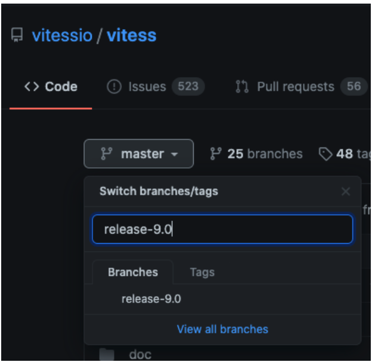
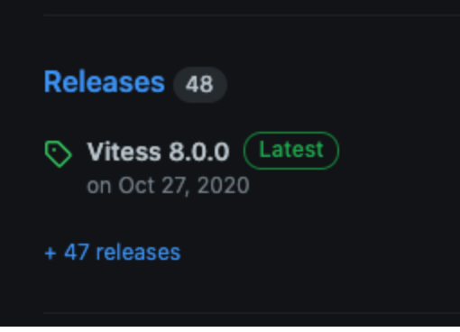
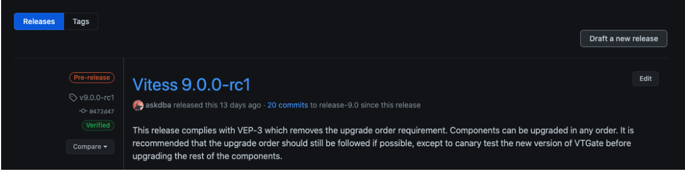
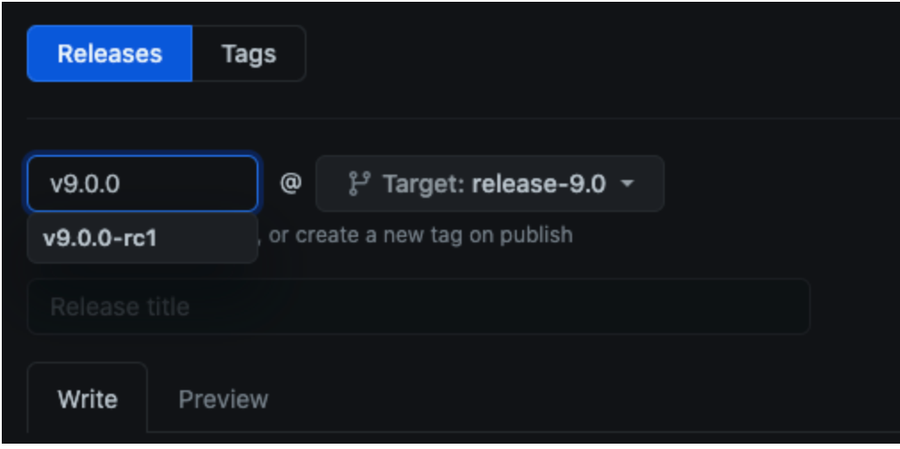

# Release Instructions

This page describes the steps for cutting a new [open source release](https://github.com/vitessio/vitess/releases).

## Versioning

Our versioning strategy is based on [VEP5](https://github.com/vitessio/enhancements/blob/main/veps/vep-5.md).

### Major Release (vX)

A new major release is needed when the public API changes in a
backward-incompatible way -- for example, when removing deprecated interfaces.

Our public API includes (but is not limited to):

*   The VTGate [RPC interfaces](https://github.com/vitessio/vitess/tree/main/proto).
*   The interfaces exposed by the VTGate client library in each language.

Care must also be taken when changing the format of any data stored by a live
system, such as topology data or Vitess-internal tables (used for sequences,
distributed transactions, etc.). Although this data is considered as internal to
Vitess, if any change breaks the upgrade path for a live system (for example,
requiring that it be shut down and reinitialized from scratch), then it must be
considered as a breaking change.

### Minor Release (vX.Y)

A new minor release indicates that functionality has been added or changed in a
backward-compatible way. This should be the majority of normal releases.

### Patch Release (vX.Y.Z)

A patch release indicates that only a select set of bugfixes have been
cherry-picked onto the associated minor release. The expectation is that
upgrading by a patch release should be painless (not requiring any config
changes) and safe (isolated from active development on `main`).

### Pre-Release Labels (vX.Y.Z-labelN)

Pre-release versions should be labeled with a suffix like `-beta2` or `-rc1`.

## Release Branches

Each major and minor releases (X.Y) should have a [release branch](https://github.com/vitessio/vitess/branches/all?query=release) named
`release-X.Y`. This branch should diverge from `main` when the code freeze when the release
is declared, after which point only bugfix PRs should be cherry-picked onto the branch.
All other activity on `main` will go out with a subsequent major or minor release.

```shell
git checkout main
git pull --ff-only upstream main

git checkout -b release-X.Y
git push upstream release-X.Y
```

The branches are named `release-X.Y` to distinguish them from point-in-time
tags, which are named `vX.Y.Z`.

## Release Tags

While the release branch is a moving target, release tags mark point-in-time
snapshots of the repository. Essentially, a tag assigns a human-readable name to
a specific Git commit hash. Although it's technically possible to reassign a tag
name to a different hash, we must never do this.

## Docker Images

Docker images built automatically on DockerHub and can be found [here](https://hub.docker.com/repository/docker/vitess/lite/).

## Java Packages

We publish binary packages for our [JDBC driver and Java client on Maven Central](https://search.maven.org/#search|ga|1|g:"io.vitess").

To do so, we use the http://oss.sonatype.org/ repository.
New packages must be uploaded there ("deployed") and will be automatically published ("released").
Once they are released there, they will be automatically synchronized with Maven Central.
The synchronization takes only several minutes, but the update on http://search.maven.org may take up to two hours.

### Access to oss.sonatype.org

[Sign up here.](https://issues.sonatype.org/secure/Signup!default.jspa)
Then you must be added as member to our `io.vitess` namespace.
Therefore, file a JIRA ticket with Sonatype to get added ([example for a different namespace](https://issues.sonatype.org/browse/OSSRH-30604)).

### One-time setup

#### Set up GPG

Follow [Sonatype's GPG instructions](https://central.sonatype.org/pages/working-with-pgp-signatures.html).

Install `gpg-agent` (needed below) e.g. on Ubuntu via: `sudo apt-get install gnupg-agent`.

#### Login configuration

Create the `settings.xml` in the `$HOME/.m2/` directory as described in their [instructions](https://central.sonatype.org/pages/apache-maven.html).

## Release Cutover 

The release cutover section is divided in 4 steps:

1. Pre requisites for either Release or Release Candidate (`rc`).
2. Creation of Release or Release Candidate (`rc`) on GitHub.
3. Post release steps.
4. Java Packages deploy.

### Pre-Requisites for Release Candidates (`rc`)

> In this example our current version is `v11` and we release the version `v12.0.0-rc1`.

* Announce dates on Vitess slack `#release-planning`.

* Fetch `github.com/vitessio/vitess`'s remote.
    ```shell
    git fetch <vitessio/vitess remote>
    ```

* Build a Release Notes document using the Makefile: 
    ```shell
    make VERSION="v12.0.0" FROM="<ref/SHA of the latest tag for v11>" TO="<ref/SHA of main>" release-notes
    ```

* Check to make sure all labels and categories set for each PR.

    > The Release Notes document can be put aside for now, it will be used when creating the release tag in a future step.

* Create a new release branch from master.
    ```shell
    git checkout -b release-12.0 upstream/main
    ```

* Run the release script using the Makefile:
    ```shell
    make RELEASE_VERSION="12.0.0-rc1" DEV_VERSION="12.0.0-SNAPSHOT" do_release
    ```
    
    > The script will prompt you `Pausing so relase notes can be added. Press enter to continue`, execute the next step and press enter.

* Put the Release Notes document in `./doc/releasenotes/12_0_0_release_notes.md`.

* Push the current dev branch to upstream. No pull request required.
    ```shell
    git push upstream release-12.0
    ```

* As prompted in the `do_release` Makefile command's output, push the the `v12.0.0-rc1` tag.
    ```shell
    git push upstream v12.0.0-rc1
    ```

* Release the tag on GitHub UI as explained in the following section.

------
### Pre-Requisites for Releases

> In this example our current version is `v11` and we release the version `v12.0.0`.


* Announce dates on Vitess slack `#release-planning`.

* Fetch `github.com/vitessio/vitess`'s remote.
    ```shell
    git fetch <vitessio/vitess remote>
    ```

* Build a Release Notes document using the Makefile:
    ```shell
    make VERSION="v12.0.0" FROM="<ref/SHA of the latest tag for v11>" TO="<ref/SHA of main>" release-notes
    ```

* Check to make sure all labels and categories set for each PR.

    > The Release Notes document can be put aside for now, it will be used when creating the release tag in a future step.

* Make sure to stand in the latest commit of the release branch (`upstream/release-12.0` in our example).
  Then, checkout to a new branch that will be used to push our release commits.
    ```shell
    git checkout -b at-release-12.0.0 upstream/release-12.0
    ```

* Run the release script using the Makefile:
    ```
    make RELEASE_VERSION="12.0.0" GODOC_RELEASE_VERSION="0.12.0" DEV_VERSION="12.0.1-SNAPSHOT" do_release
    ```

    > The script will prompt you `Pausing so relase notes can be added. Press enter to continue`, execute the next step and press enter.

* Put the Release Notes document in `./doc/releasenotes/12_0_0_release_notes.md`.

* Put the output in `./doc/releasenotes/12_0_0_release_notes.md`.

* Push your current branch and create a pull request against the existing `release-12.0` branch.
    ```shell
    git push origin at-release-12.0.0
    ```

* As prompted in the `do_release` Makefile command's output, push the `v12.0.0` and `v0.12.0` tags.
    ```shell
    git push upstream v12.0.0 && git push upstream v0.12.0
    ```

* Release the tag on GitHub UI as explained in the following section.

### Creating Release or Release Candidate

> In the below steps, we use `v8.0.0` and `v9.0.0` as an example.

#### 1. Open the releases page

On Vitess' GitHub repository main page, click on Code -> [Releases](https://github.com/vitessio/vitess/releases).



#### 2. Draft a new release

On the Releases page, click on `Draft a new release`.



#### 3. Tag a new release

When drafting a new release, we are asked to choose the release's tag and branch.
We format the tag this way: `v9.0.0`. We append `-rcN` to the tag name for release candidates,
with `N` being the increment of the release candidate.



#### 4. Add release notes and release

Copy/paste the previously built Release Notes into the description of the release.

If this is a pre-release (`rc`) select the `pre-release` checkbox.

And finally, click on `Publish release`.



### Post Release Steps
* Announce new release in Vitess Slack `#general` channel. 
* Create a new [PR](https://github.com/vitessio/website/pull/670) for Vitess Blog. 
* Netlify -> Sites →vitess.io → Deploy 
* Coordinate CNCF cross-posting Vitess Blog. 
* Schedule and publish Tweet on Vitess account.
* Run following script to once the `base` Docker image is live. 

```
https://github.com/vitessio/vitess/blob/master/helm/release.sh
```

* Deploy and release Java packages by following the `Java Packages Deploy & Release` section below. 

### Java Packages Deploy & Release

> **Warning:** This section's steps need to be executed only when releasing a new major version of Vitess,
> or if the Java packages changed from one minor/patch version to another.
> 
> For this example, we assume we juste released `v12.0.0`.

1.  Checkout to the release commit.
    ```shell
    git checkout v12.0.0
    ```

2.  Run `gpg-agent` to avoid that Maven will constantly prompt you for the password of your private key.

    ```bash
    eval $(gpg-agent --daemon --no-grab --write-env-file $HOME/.gpg-agent-info)
    export GPG_TTY=$(tty)
    export GPG_AGENT_INFO
    ```

3.  Deploy (upload) the Java code to the oss.sonatype.org repository:

    > **Warning:** After the deployment, the Java packages will be automatically released. Once released, you cannot delete them. The only option is to upload a newer version (e.g. increment the patch level).</p>

    ```bash
    mvn clean deploy -P release -DskipTests
    cd ..
    ```
