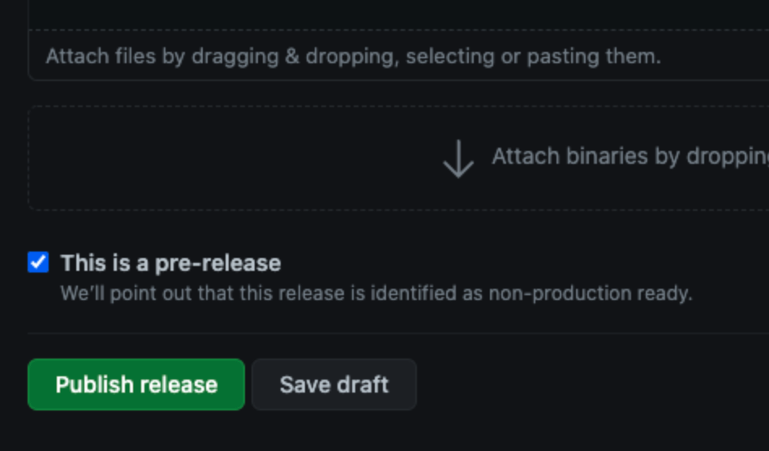

# Release Instructions

This page describes the steps for cutting a new [open source release](https://github.com/vitessio/vitess/releases). We will be using v11.0.0 for example. 

## Versioning

Our versioning strategy is based on [VEP5](https://github.com/vitessio/enhancements/blob/main/veps/vep-5.md).

### Major Release (vX)

A new major release is needed when the public API changes in a
backward-incompatible way -- for example, when removing deprecated interfaces.

Our public API includes (but is not limited to):

*   The VTGate [RPC interfaces](https://github.com/vitessio/vitess/tree/main/proto).
*   The interfaces exposed by the VTGate client library in each language.

Care must also be taken when changing the format of any data stored by a live
system, such as topology data or Vitess-internal tables (used for sequences,
distributed transactions, etc.). Although this data is considered internal to
Vitess, if any change breaks the upgrade path for a live system (for example,
requiring that it be shut down and reinitialized from scratch), then it must be
considered a breaking change.

### Minor Release (vX.Y)

A new minor release indicates that functionality has been added or changed in a
backward-compatible way. This should be the majority of normal releases.

### Patch Release (vX.Y.Z)

A patch release indicates that only a select set of bugfixes have been
cherrypicked onto the associated minor release. The expectation is that
upgrading by a patch release should be painless (not requiring any config
changes) and safe (isolated from active development on `main`).

### Pre-Release Labels (vX.Y.Z-label.N)

Pre-release versions should be labeled with a suffix like `-beta.2` or `-rc.1`.
The dot before the number is important for correct determination of version
precedence.

## Milestones

[GitHub Milestones](https://github.com/vitessio/vitess/milestones) are hotlists
for Issues and Pull Requests.

When it's time to start planning a new Vitess release, create a milestone for it
and tag the following items under it:

*   Issues that are release-blockers for that milestone.
*   For major/minor releases:
    *   Pull Requests that must be merged before cutting that milestone. This
        makes it clear what we're waiting for.
*   For patch releases:
    *   Pull Requests that should be cherrypicked into the release branch for
        that milestone. Any other PRs will be ignored and must wait for the next
        minor release.

## Release Branches

Each minor release level (X.Y) should have a [release branch](https://github.com/vitessio/vitess/branches/all?query=release) named
`release-X.Y`. This branch should diverge from `main` when the code freeze for
that release is declared, after which point only bugfix PRs should be
cherrypicked onto the branch. All other activity on `main` will go out with a
subsequent minor release.

```bash
git checkout main
git pull --ff-only upstream main

git checkout -b release-X.Y
git push upstream release-X.Y
```

The branches are named `release-X.Y` to distinguish them from point-in-time
tags, which are named `vX.Y.Z`.

## Release Tags

While the release branch is a moving target, release tags mark point-in-time
snapshots of the repository. Essentially, a tag assigns a human-readable name to
a specific Git commit hash. Although it's technically possible to reassign a tag
name to a different hash, we must never do this.

Since a tag represents a particular point in time, only patch releases (X.Y.Z)
have tags. These should be defined as [annotated tags]
(https://git-scm.com/book/en/v2/Git-Basics-Tagging#Annotated-Tags) from the
associated release branch, after all cherrypicks have been applied and tested.

```bash
git checkout release-X.Y
git pull --ff-only upstream release-X.Y

git cherry-pick <commit> ...

git tag -a vX.Y.Z
```

Note that this only creates the tag in your local Git repository. Pushing the
tag up to GitHub will be the last step, because it is the point of no return.
That's because if someone has already fetched the tag, they will not get updated
if you change the tag. Therefore, if you need to tag a different commit after
pushing to upstream, you must increment the version number and create a new tag
(i.e. a new release).

## Docker Images

Docker images built automatically on DockerHub and can be found [here](https://hub.docker.com/repository/docker/vitess/lite/)

## Testing

### Local Tutorial

We must check that the [local startup
tutorial](#start-a-vitess-cluster)
is not broken.

Instead of going through the steps manually, run the `local_example` test which
should have the same commands as the tutorial. You can use our `test.go` test
runner to run the test for all MySQL flavors. `-parallel=2` will run two tests
in parallel to shorten the test duration.

```bash
./test.go -flavor=all -pull=false -parallel=2 local_example
```

### Kubernetes Tutorial

Follow the [Kubernetes tutorial](), which will
automatically use the latest Docker images you pushed.

TODO(mberlin): Describe how to launch our new cluster tests in `test/cluster`
instead.

## Java Packages

We publish binary packages for our [JDBC driver and Java client on Maven Central](https://search.maven.org/#search|ga|1|g:"io.vitess").

To do so, we use the http://oss.sonatype.org/ repository.
New packages must be uploaded there ("deployed") and will be automatically published ("released").
Once they are released there, they will be automatically synchronized with Maven Central.
The synchronization takes only several minutes but the update on http://search.maven.org may take up to two hours.

### Access to oss.sonatype.org

[Sign up here.](https://issues.sonatype.org/secure/Signup!default.jspa)
Then you must be added as member to our `io.vitess` namespace.
Therefore, file a JIRA ticket with Sonatype to get added ([example for a different namespace](https://issues.sonatype.org/browse/OSSRH-30604)).

### One-time setup

**Set up GPG**

Follow [Sonatype's GPG instructions](https://central.sonatype.org/pages/working-with-pgp-signatures.html).

Install `gpg-agent` (needed below) e.g. on Ubuntu via: `sudo apt-get install gnupg-agent`

**Login configuration**

Create the `settings.xml` in the `$HOME/.m2/` directory as described in their [instructions](https://central.sonatype.org/pages/apache-maven.html).

## Release Cutover 
*Please note we'll be using v11.0 as an example below. Numbers need to change in each release*

### Pre-Requisites for Release Candidate

* Announce dates on Vitess slack #release-planning

* Build a Release Notes Document 
```
git fetch --all
make RELEASE_BRANCH=“release-11” FROM=“740c3799dc824977608d29c793b3bf1dbe1e9811" TO=“cc2de83572ea6116ebef7e051b9a8ca7597d1164” release-notes
```
 * Check to make sure all labels and categories set for each PR.

 * This will be used when running the release script

 * Put the output in ./doc/releasenotes/12_0_0_release_notes.md

 * Create a new release branch from master.
```
git checkout -b release-12.0 upstream/main
```
 * Run the release script:
```
make RELEASE_VERSION="12.0.0-rc1" GODOC_RELEASE_VERSION="0.12.0" DEV_VERSION="12.0.0-SNAPSHOT" do_release
```
* Push the current dev branch to upstream. No PR needed
```
git push upstream release-12.0
```
### Pre-Requisites All Other Releases

* Dry Run and Build a Release Notes Document 
```
git fetch --all

make RELEASE_BRANCH=“release-12” FROM=“740c3799dc824977608d29c793b3bf1dbe1e9811" TO=“cc2de83572ea6116ebef7e051b9a8ca7597d1164” release-notes
```
* Make sure to stand in the latest commit of the dev-branch
```
git fetch upstream 
git checkout -b at-release-12.0.0 upstream/release-12.0
```
* Run the release script:
```
make RELEASE_VERSION="12.0.0" GODOC_RELEASE_VERSION="0.12.0" DEV_VERSION="12.0.1-SNAPSHOT" do_release
```
* Build a Release Notes Document
```
make FROM="29a494f7b45faf26eaaa3e6727b452a2ef254101" TO="upstream/release-11.0" release-notes
```
 * This will be used when running the release script
 * Put the output in ./doc/releasenotes/12_0_0_release_notes.md

* Push current dev branch and create a PR against the existing release-12.0 dev branch
```
git push origin at-release-12.0.1
```
* Push created tag to upstream so it can be used for the release
```
git push upstream v12.0.0
```
* Release the tag on GitHub UI

### Creating Release (or Candidate)

#### 1. Create a new branch

If needed, create a new branch with the following existing naming convention. We usually do this while creating RC1 and re-use it for GA release, as well as any patch release of the same major release.

> **For instance:**
> 
> - If we are currently on release 8, and we want to release `v9.0.0-rc1`, we will create a `release-9.0` branch.
> - Once `v9.0.0-rc1` is out, any new commit on the `release-9.0` branch will be used to publish the next releases of the same major increment (`v9.0.0`, `v9.0.1`, `v9.0.2`, etc).


#### 2. Open the releases page

On Vitess' GitHub repository main page, click on Code -> [Releases](https://github.com/vitessio/vitess/releases).


#### 3. Draft a new release

On the Releases page, click on `Draft a new release`.


#### 4. Tag a new release

When drafting a new release, we are asked to choose the release's tag and branch. The tag is formated this way: `v9.0.0`. The naming convention for release candidates is to append `-rc1` to the tag name. The branch is the same one as the one we've created in the first step. 


#### 5. Add release notes and release

Copy/paste the previously built Release Notes into the description of the release.

If this is a pre-release (RC) select the `pre-release` checkbox.

And finally, click on `Publish release`.



### Post Release Steps
* Announce new release in Vitess Slack #general channel. 
* Create a new [PR](https://github.com/vitessio/website/pull/670) for Vitess Blog.
 - Netlify -> Sites →vitess.io → Deploy

* Coordinate CNCF cross-posting Vitess Blog. 
* Schedule and publish Tweet on Vitess account. 
* Update “.github/workflows/cluster_endtoend_upgrade.yml” workflow file on the main(master) branch with the new release.
* Run following script to once the `base` Docker image is live. 
```
https://github.com/vitessio/vitess/blob/master/helm/release.sh
```
* Add Java version and release by following Java Packages below. 

### Deploy & Release

1.  Make sure you are in the release branch.

1.  Change the version number in all `pom.xml` files with the "versions" plugin:

    ```bash
    # The Java version must not have the leading "v".
    # Example: 2.1.0 and not v2.1.0.
    # Use Bash substitution to remove the leading "v".
    JAVA_VERSION=${PATCH/v/}
    cd java
    mvn versions:set -DnewVersion=$JAVA_VERSION
    ```

1.  Run `git diff java/` to double check that the version was updated correctly.

1.  Create a Git commit with the version change while you are in the **release** branch (not main). You will push it later.

1.  Run `gpg-agent` to avoid that Maven will constantly prompt you for the password of your private key.

    ```bash
    eval $(gpg-agent --daemon --no-grab --write-env-file $HOME/.gpg-agent-info)
    export GPG_TTY=$(tty)
    export GPG_AGENT_INFO
    ```

1.  Deploy (upload) the Java code to the oss.sonatype.org repository:

    <p class="warning"><b>Warning:</b> After the deployment, the Java packages will be automatically released. Once released, you cannot delete them. The only option is to upload a newer version (e.g. increment the patch level).</p>

    ```bash
    mvn clean deploy -P release
    cd ..
    ```

At the end of the release, you will also have to bump the SNAPSHOT version in the main branch (see [below](#bump-java-snapshot-version)).

## Push the release branch and tag to upstream

Note that we're pushing to upstream (vitessio/vitess), not origin (your fork).

<p class="warning"><b>Warning:</b> After the following push, there's no going
back, since tags don't get updated if someone else has fetched them already.
If you need to re-tag after this point, you MUST increment the version number.
</p>

```bash
# release branch
git push upstream release-X.Y
# release tag
git push upstream vX.Y.Z
```

## Add release notes and send announcement

[Find your new tag](https://github.com/vitessio/vitess/tags) and add release
notes. Use the GitHub [Compare](https://github.com/vitessio/vitess/compare) tool
to see all the commits since the last release.

Then send an announcement on the [vitess-announce](https://groups.google.com/forum/#!forum/vitess-announce) list.

## Bump Java SNAPSHOT version

The Java version in the **main** branch has the suffix `-SNAPSHOT` and should always reference the **next** release number.
For example, if you just released `2.1.0`, you could bump it to `2.1.1-SNAPSHOT`.

Change the SNAPSHOT version as follows:

```bash
git checkout main
git pull --ff-only upstream main

# Example:
# (Note that there is no leading "v".)
JAVA_VERSION=2.1.1-SNAPSHOT
cd java
mvn versions:set -DnewVersion=$JAVA_VERSION

# Verify diff.
git diff

git commit -a -m "java: Bump SNAPSHOT version to $JAVA_VERSION after Vitess release $PATCH."

git push upstream main
```
