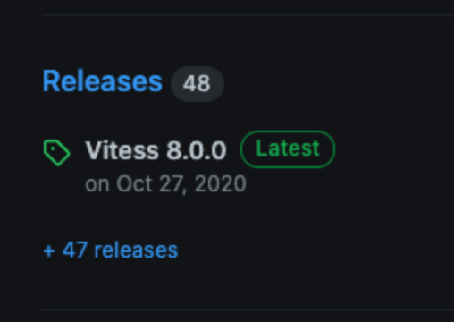
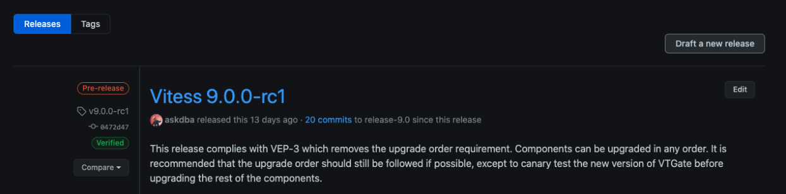
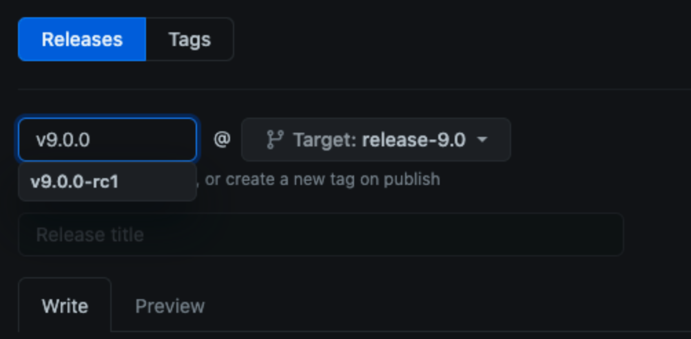
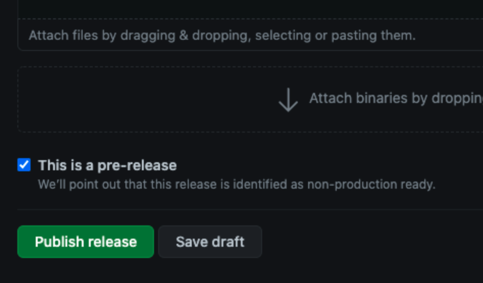

# Release Cutover

In this section we describe our current release process. Below is a summary of this document.

- [**Pre-requisite for the release team**](#pre-requisites)
- [**Overview**](#overview)
- [**Pre-Release**](#pre-release)
- [**Release**](#release)
- [**Post-Release**](#post-release)
- [**How To prepare the release of Vitess**](#how-to-prepare-the-release-of-vitess)
- [**How To Release Vitess**](#how-to-release-vitess)
- [**How To Code Freeze**](#how-to-code-freeze)
- [**How To Merge During Code Freeze**](#how-to-merge-during-code-freeze)
- [**Java Packages: Deploy & Release**](#java-packages-deploy--release)


-----

## Pre-Requisites

This section highlights the different pre-requisites the release team has to meet before releasing.

- The tool `gh` must be installed locally and ready to be used.
- You must have access to the Java release, more information in the [**Java Packages**](./java-packages.md) section.
- You must be able to create branches and have admin right on the `vitessio/vitess` and `planetscale/vitess-operator` repositories.

-----

## Overview

### Schedule

A new major version of Vitess is released every four months. For each major version there is at least one release candidate, which we release three weeks before the GA version.
We usually create the RC1 during the first week of the month, and the GA version three weeks later.

### Code Freeze

Before creating RC1, there is a code freeze. Assuming the release of RC1 happens on a Tuesday, the release branch will be frozen Friday of the previous week.
This allows us to test that the release branch can be released and avoid discovering unwanted events during the release day. Once the RC1 is released, there are three more weeks to backport bug fixes into the release branches.
However, we also proceed to a code freeze the Friday before the GA release. (Assuming GA is on a Tuesday)
Regarding patch releases, no code freeze is planned.

### Tracking Issue for each Release

For each release, it is recommended to create an issue like [this one](https://github.com/vitessio/vitess/issues/10476) to track the current and past progress of a release.
It also allows us to document what happened during a release.

-----

## Pre-Release

This step happens a few weeks before the actual release (whether it is an RC, GA or a patch release).
The main goal of this step is to make sure everything is ready to be released for the release day.
That includes:
- **Making sure Pull Requests are being reviewed and merged.**
  > - All the Pull Requests that need to be in the release must be reviewed and merged before the code freeze.
  > - The code freeze usually happens a few days before the release.
- **Making sure the people doing the release have access to all the tools and infrastructure needed to do the release.**
  > - This includes write access to the Vitess repository and to the Maven repository.
- **Preparing and cleaning the release notes summary.**
  > - If the release does not contain significant changes (i.e. a small patch release) then this step can be skipped
  > - One or more Pull Requests have to be submitted in advance to create and update the release summary.
  > - The summary files are located in: `./changelog/*.0/*.*.*/summary.md`.
  > - The summary file for a release candidate is the same as the one for the GA release.
  > - Make sure to run `go run ./go/tools/releases/releases.go` to update the `changelog` directory with the latest release notes.
- **Finishing the blog post, and coordinating with the different organizations for cross-posting. Usually CNCF and PlanetScale. This step applies only for GA releases.**
  > - The blog post must be finished and reviewed.
  > - A Pull Request on the website repository of Vitess has to be created so we can easily publish the blog during the release day.
- **Code freeze.**
  > - As soon as we go into code freeze, if we are doing an RC, create the release branch.
  > - If we are doing a GA release, do not merge any new Pull Requests.
  > - The guide on how to do a code freeze is available in the [How To Code Freeze](#how-to-code-freeze) section.
  > - It is not advised to merge a PR during code freeze, but if it is deemed necessary by the release lead, then follow the steps in [How To Merge During Code Freeze](#how-to-merge-during-code-freeze) section.
- **Create the Vitess release.**
  > - A guide on how to create a Vitess release is available in the [How to prepare the release of Vitess](#how-to-prepare-the-release-of-vitess) section.
  > - This step will create a Release Pull Request, it must be reviewed and merged before the release day. The release commit will be used to tag the release.
- **Preparing the Vitess Operator release.**
  > - While the Vitess Operator is located in a different repository, we also need to do a release for it.
  > - The Operator follows the same cycle: RC1 -> GA -> Patches.
  > - Documentation for the pre-release of the Vitess Operator is available [here](https://github.com/planetscale/vitess-operator/blob/main/docs/release-process.md#prepare-for-release).
- **Update the website documentation.**
  > - We want to open a preparatory **draft** Pull Request to update the documentation.
  > - There are several pages we want to update:
  >  - [The releases page](https://vitess.io/docs/releases/): we must add the new release to the list with all its information and link. The links can be broken (404 error) while we are preparing for the release, this is fine.
  >  - [The local install page](https://vitess.io/docs/get-started/local/): we must use the proper version increment for this guide and the proper SHA. The SHA will have to be modified once the Release Pull Request and the release is tagged is merged.
  >  - [The Vitess Operator for Kubernetes page](https://vitess.io/docs/get-started/operator/#install-the-operator), [the Local Install via source for Mac page](https://vitess.io/docs/get-started/local-mac/#install-vitess), [the Local Install via Docker page](https://vitess.io/docs/get-started/local-docker/#check-out-the-vitessiovitess-repository), and [the Vttestserver Docker Image page](https://vitess.io/docs/get-started/vttestserver-docker-image/#check-out-the-vitessiovitess-repository): we must checkout to the proper release branch after cloning Vitess.
  > - If we are doing a GA or RC release follow the instructions below:
  >  - There are two scripts in the website repository in `./tools/{ga|rc}_release.sh`, use them to update the website documentation. The scripts automate:
  >  - For an RC, we need to create a new entry in the sidebar which represents the next version on `main` and mark the version we are releasing as RC.
  >  - For a GA, we need to mark the version we are releasing as "Stable" and the next one as "Development".
- **Create a new GitHub Milestone**
  > - Our GitHub Milestones is a good representation of all our ongoing development cycles. We have a Milestone for `main` and for all release branches. 
  > - After doing Code Freeze, we can create a new GitHub Milestone that matches the next development cycle.
  >  - **If we release a major version (v18.0.0-rc1):** we must create a `v19.0.0` Milestone.
  >  - **If we release a patch release (v17.0.3):** we must create a `v17.0.4` Milestone.

-----

## Release

On the release day, there are several things to do:

- **Merge the Release Pull Request.**
  > - During the code freeze, we created a Release Pull Request. It must be merged.
- **Tag the Vitess release.**
  > - A guide on how to tag a version is available in the [How To Release Vitess](#how-to-release-vitess) section.
- **Update the release notes on `main`.**
  > - One Pull Request against `main` must be created, it will contain the new release notes that we are adding in the Release Pull Request.
- **Create the corresponding Vitess operator release.**
  > - Applies only to versions greater or equal to `v14.0.0`.
  > - If we are doing an RC release, then we will need to create the Vitess Operator RC too. If we are doing a GA release, we're also doing a GA release in the Operator.
  > - The Vitess Operator release documentation is available [here](https://github.com/planetscale/vitess-operator/blob/main/docs/release-process.md#cut-release).
- **Create the Java release.**
  > - Applies only to GA releases.
  > - This step is explained in the [Java Packages: Deploy & Release](#java-packages-deploy--release) section.
- **Update the website documentation repository.**
  > - Review the Website Pull Request that was opened during the Pre-Release.
  > - The git SHA used in [the local install page](https://vitess.io/docs/get-started/local/) should be updated with the new proper SHA for this release.
  > - Merge the Pull Request.
- **Publish the blog post on the Vitess website.**
  > - Applies only to GA releases.
  > - The corresponding Pull Request was created beforehand during the pre-release. Merge it.
- **Make sure _arewefastyet_ starts benchmarking the new release.**
  > - This can be done by visiting [arewefastyet status page](https://benchmark.vitess.io/status).
  > - New elements should be added to the execution queue.
  > - After a while, those elements will finish their execution and their status will be green.
  > - This step is even more important for GA releases as we often include a link to _arewefastyet_ in the blog post.
  > - The benchmarks need to complete before announcing the blog posts or before they get cross-posted.
- **Go back to dev mode on the release branch.**
  > - The version constants across the codebase must be updated to `SNAPSHOT`.
- **Ensure the k8s images are available on DockerHub.**
- **Close the current GitHub Milestone**
  > - Once we are done releasing the current version, we must close its corresponding GitHub Milestone as the development cycle for it is over.
  > - **This does not apply if we are releasing an RC release.** For instance, if we are releasing `v18.0.0-rc1` we want to keep the `v18.0.0` milestone opened as development is not fully done for `v18.0.0`. 
  > - For instance, if we release `v18.0.1`, we must close the `v18.0.1` Milestone as the development cycle for `v18.0.1` is over.
  > - When closing a Milestone, we need to look through all the PRs/Issues in that Milestone and re-assign a newer Milestone to them.

-----

## Post-Release

Once the release is over, we need to announce it on both Slack and Twitter. We also want to make sure the blog post was cross-posted, if applicable.
We need to verify that _arewefastyet_ has finished the benchmark too.

Moreover, once the roadmap discussions are over for the next release, we need to update the roadmap presented in the Vitess website (https://vitess.io/docs/resources/roadmap/).
We must remove everything that is now done in this release and add new items based on the discussions.

-----

## How to prepare the release of Vitess

> In this example our current version is `v14.0.3` and we release the version `v15.0.0`.
> Alongside Vitess' release, we also release a new version of the operator.
> Since we are releasing a release candidate here, the new version of the operator will also be a release candidate.
> In this example, the new operator version is `2.8.0`.
>
> It is important to note that before the RC, there is a code freeze during which we create the release branch.
>
> The release branch in this example is `release-15.0`.
>
> The example also assumes that `origin` is the `vitessio/vitess` remote.

1. Fetch `github.com/vitessio/vitess`'s remote.
    ```shell
    git fetch origin
    ```

2. Creation of the Release Pull Request.
   > This step will create the Release Pull Request that will then be reviewed ahead of the release day.
   > The merge commit of that Pull Request will be used during the release day to tag the release.
    1. Run the `create_release` script using the Makefile:
        1. Release Candidate:
            ```shell
            make BASE_BRANCH="release-15.0" BASE_REMOTE="origin" RELEASE_VERSION="15.0.0-rc1" VTOP_VERSION="2.8.0-rc1" create_release
            ```
        2. General Availability:
           ```shell
           make BASE_BRANCH="release-15.0" BASE_REMOTE="origin" RELEASE_VERSION="15.0.0" VTOP_VERSION="2.8.0" create_release
           ```

       The script will prompt you `Pausing so release notes can be added. Press enter to continue`. We are now going to generate the release notes, continue to the next sub-step.

    2. Run the following command to generate the release notes. Note that you can omit the `--summary` flag if there are no summary.
        ```shell
        go run ./go/tools/release-notes --version "v15.0.0" --summary "./changelog/15.0/15.0.0/summary.md"
        ```

       > Make sure to also run `go run ./go/tools/releases/releases.go` to update the `./changelog` directory.

       > Important note: The release note generation fetches a lot of data from the GitHub API. You might reach the API request limit.
       In which case you should use the `--threads=` flag and set an integer value lower than 10 (the default).

       This command will generate the release notes by looking at all the commits between the tag `v14.0.3` and the reference `HEAD`.
       It will also use the file located in `./changelog/15.0/15.0.0/summary.md` to prefix the release notes with a text that the maintainers wrote before the release.
       Please verify the generated release notes to make sure it is well-formatted and all the bookmarks are generated properly.


3. Follow the instruction prompted by the `create_release` Makefile command's output in order to push the newly created branch and create the Release Pull Request on GitHub.

4. If we are doing an RC release it means we created a new branch from `main`. We need to update `main` with the next SNAPSHOT version. If `main` was on `15.0.0-SNAPSHOT`, we need to update it to `16.0.0-SNAPSHOT`. A simple find and replace in the IDE is sufficient, there only a handful of files that must be changed: `version.go` and several java files.

-----

## How To Release Vitess
This section is divided into two parts:
- [Creation of the tags and release notes](#creation-of-the-tags-and-release-notes).
- [Creating Release or Release Candidate on the GitHub UI](#creating-release-or-release-candidate-on-the-github-ui)

### Creation of the tags and release notes

> This step implies that you have created a [Release Pull Request](#how-to-prepare-the-release-of-vitess) beforehand and that it has been reviewed.
> The merge commit of this Release Pull Request will be used to tag the release.
>
> In this example our current version is `v14.0.3` and we release the version `v15.0.0`.
> Alongside Vitess' release, we also release a new version of the operator.
> Since we are releasing a release candidate here, the new version of the operator will also be a release candidate.
> In this example, the new operator version is `2.8.0`.
>
> It is important to note that before the RC, there is a code freeze during which we create the release branch.
>
> The release branch in this example is `release-15.0`.
>
> The example also assumes that `origin` is the `vitessio/vitess` remote.

1. Fetch `github.com/vitessio/vitess`'s remote.
    ```shell
    git fetch origin
    ```

2. Checkout to the merge commit of the Release Pull Request.

3. Tag the release and push the tags
   ```shell
   git tag v15.0.0 && git tag v0.15.0 && git push origin v15.0.0 && git push origin v0.15.0
   ```

4. Create a Pull Request against the `main` branch with the release notes found in `./changelog/15.0/15.0.0/15_0_0_*.md`.

5. Run the back to dev mode tool.
   ```shell
   make BASE_BRANCH="release-15.0" BASE_REMOTE="origin" RELEASE_VERSION="15.0.0-rc1" DEV_VERSION="15.0.0-SNAPSHOT" back_to_dev_mode
   ```
   > You will then need to follow the instructions given by the output of the back_to_dev_mode Makefile command. You will need to push the newly created branch and open a Pull Request.

6. Release the tag on GitHub UI as explained in the following section.

### Creating Release or Release Candidate on the GitHub UI

> In the below steps, we use `v8.0.0` and `v9.0.0` as an example.

#### 1. Open the releases page

On Vitess' GitHub repository main page, click on Code -> [Releases](https://github.com/vitessio/vitess/releases).



#### 2. Draft a new release

On the Releases page, click on `Draft a new release`.



#### 3. Tag a new release

When drafting a new release, we are asked to choose the release's tag and branch.
We format the tag this way: `v9.0.0`. We append `-rcN` to the tag name for release candidates,
with `N` being the increment of the release candidate.



#### 4. Add release notes and release

Copy/paste the previously built Release Notes into the description of the release.

If this is a pre-release (`rc`) select the `pre-release` checkbox.

And finally, click on `Publish release`.



-----

## How To Code Freeze

In this example we are going to do a code freeze on the `release-15.0` branch. If we are doing a release candidate, there won't be a branch yet, hence we need to create it.

```
git fetch --all
git checkout -b release-15.0 origin/main
```

> Important: after creating the new branch `release-15.0`, we need to create new branch protection rules on the GitHub UI.
> The rules can be copied from the rules that are on the `main` branch.

The new branch will be based on `origin/main`, here `origin` points to `vitessio/vitess`. If we are not doing a release candidate, then the branch already exists and we can checkout on it.

Now, if we are doing a GA release, let's update the branch:

```
git pull origin release-15.0
```

Finally, let's run the code freeze script:

```
./tools/code_freeze.sh freeze release-15.0
```

The script will prompt the command that will allow you to push the code freeze change. Once pushed, open a PR that will be merged on `release-15.0`.

Remember, you should also disable the Launchable integration from the newly created release branch.

-----

## How To Merge During Code Freeze

> **Warning:** It is not advised to merge a PR during code-freeze. If it is deemed absolutely necessary, then the following steps can be followed.

The PR that needs to be merged will be failing on the `Code Freeze` CI. To merge this PR, we'll have to mark this CI action as not required.
You will need administrator privileges on the vitess repository to be able to make this change.

1. Go to the GitHub repository and click on `Settings`.
2. Under the `Code and automation` section, select `Branches`.
3. Find the branch that you want to merge the PR against and then select `Edit`.
4. Scroll down to find the list of required checks.
5. Within this list find `Code Freeze` and click on the cross next to it to remove it from this list.
6. Save your changes on the bottom of the page.
7. Refresh the page of the PR, and you should be able to merge it.
8. After merging the PR, you need to do 2 more things -
    1. Add `Code Freeze` back as a required check.
    2. Check if the release PR has any merge conflicts. If it does, fix them and push.

-----

## Java Packages: Deploy & Release

> **Warning:** This section's steps need to be executed only when releasing a new major version of Vitess,
> or if the Java packages changed from one minor/patch version to another.
>
> For this example, we assume we juste released `v12.0.0`.

1. Checkout to the release commit.
    ```shell
    git checkout v12.0.0
    ```

2. Run `gpg-agent` to avoid that Maven will constantly prompt you for the password of your private key. Note that this can print error messages that can be ignored on Mac.

    ```bash
    eval $(gpg-agent --daemon --no-grab --write-env-file $HOME/.gpg-agent-info)
    export GPG_TTY=$(tty)
    export GPG_AGENT_INFO
    ```

3. Export following to avoid any version conflicts
    ```bash
    export MAVEN_OPTS="--add-opens=java.base/java.util=ALL-UNNAMED --add-opens=java.base/java.lang.reflect=ALL-UNNAMED --add-opens=java.base/java.text=ALL-UNNAMED 
    --add-opens=java.desktop/java.awt.font=ALL-UNNAMED"
    ```

4. Deploy (upload) the Java code to the oss.sonatype.org repository:

   > **Warning:** After the deployment, the Java packages will be automatically released. Once released, you cannot delete them. The only option is to upload a newer version (e.g. increment the patch level).</p>

    ```bash
    cd ./java/
    mvn clean deploy -P release -DskipTests
    cd ..
    ```

5. It will take some time for artifacts to appear on [maven directory](https://mvnrepository.com/artifact/io.vitess/vitess-client)
