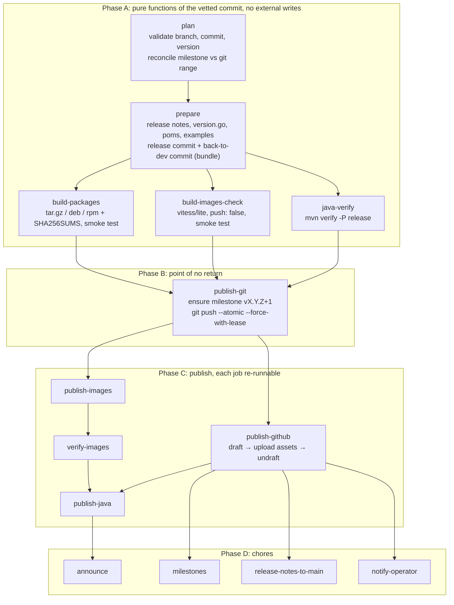

# Patch Release Automation

This page describes the GitHub Actions workflow that replaces the manual,
`vitess-releaser`-driven process for **patch releases** (`vX.Y.Z` with
`Z > 0`). RC and GA releases keep using `vitess-releaser` until the same
machinery is extended to them. The design was discussed in
[vitessio/vitess#21001](https://github.com/vitessio/vitess/issues/21001).

- [Status](#status)
- [Design](#design)
- [Running a dry run](#running-a-dry-run)
- [The jobs](#the-jobs)
- [The scripts](#the-scripts)
- [Milestones](#milestones)
- [Re-execution](#re-execution)
- [Settings outside the repository](#settings-outside-the-repository)
- [Rollout](#rollout)
- [Future slots](#future-slots)

-----

## Status

| Phase | Jobs | State |
|---|---|---|
| A: prepare and verify | `plan`, `prepare`, `build-packages`, `build-images-check`, `java-verify` | implemented |
| B: point of no return | `publish-git` | not yet |
| C: publish | `publish-images`, `verify-images`, `publish-github`, `publish-java` | not yet |
| D: chores | `milestones`, `release-notes-to-main`, `notify-operator`, `announce` | not yet |

Today the workflow is the dry run of a patch release: it produces the exact
release commits, release notes and packages as workflow artifacts and
publishes nothing. Patch releases are still cut with `vitess-releaser`.

-----

## Design

One workflow, `.github/workflows/release.yml`, lives on `main` and is
dispatched with the release branch and, optionally, the exact commit the
operator vetted. It checks out `main` for the tooling and the release branch
for the content, so nothing under `tools/release/` ever needs backporting.

Four rules shape it:

- **Build everything before anything becomes visible.** Packages, the
  `vitess/lite` image and the Java build all run from the release commit
  before it exists anywhere but in a workflow artifact.
- **One atomic push is the point of no return.** The release commit, both tags
  (`vX.Y.Z` and the Go module tag `v0.X.Z`) and the back-to-dev commit land in
  a single `git push --atomic` guarded by `--force-with-lease`. If anyone
  merged to the branch during the run, the push is rejected and nothing has
  been published. The branch is never observable in a non-SNAPSHOT state.
- **Publish steps are independently re-runnable.** Anything a consumer may
  already have seen (tags, published release assets, Maven artifacts) is
  verified and never rewritten. Anything not yet visible (drafts, workflow
  artifacts) is freely overwritten.
- **No code freeze, no protection bypass by humans.** A GitHub App on the
  ruleset bypass list pushes the release commit. The lease and a per-branch
  concurrency group are the freeze.



-----

## Running a dry run

Any member of the release team can dispatch the workflow from the Actions
tab or with `gh`:

```shell
gh workflow run release.yml \
  -f release_branch=release-23.0 \
  -f sha=$(git rev-parse origin/release-23.0)
```

| Input | Meaning |
|---|---|
| `release_branch` | `release-X.0`, required. |
| `sha` | The commit the patch is cut from. It must be the current tip of the branch, otherwise the run fails with both hashes: someone merged after you looked. Leave it empty to take the tip at dispatch time. |
| `allow_empty` | Allow a release without any pull request since the previous tag. |

The run's summary page shows the plan, the reconciliation table of the
milestone against the branch, the two commits with their diff stats, the
release notes and the packages with their checksums. The artifacts hold the
same in file form:

| Artifact | Contents |
|---|---|
| `release-plan` | `plan.json` (every derived value and both pull request sets), `plan.md` |
| `release-prep` | `release.bundle` (a git bundle with `refs/release/release` and `refs/release/back-to-dev`), `release_notes.md`, `changelog.md`, `release.diff`, `back-to-dev.diff`, `prep.json`, `prep.md` |
| `release-packages` | the `tar.gz`, `deb` and `rpm`, `SHA256SUMS`, `packages.md` |
| `java-artifacts` | the jars `mvn verify -P release` produced |

To inspect the commits locally:

```shell
gh run download <run-id> -n release-prep -D /tmp/prep
git fetch /tmp/prep/release.bundle 'refs/release/*:refs/release/*'
git log --stat origin/release-23.0..refs/release/back-to-dev
```

-----

## The jobs

All jobs run on `ubuntu-24.04` with `permissions: {}` at the top of the
workflow and only what each job needs granted per job. Inputs reach scripts
through `env:`, never interpolated into `run:`. Actions are SHA-pinned and
checkouts use `persist-credentials: false`.

**plan** (`tools/release/plan.sh`, `contents`, `issues` and `pull-requests`
read):

1. The branch must match `release-X.0`. If `sha` is given it must be a full
   hash equal to the branch tip; the tip becomes the base commit.
2. `version.go` at the base commit must read `X.Y.Z-SNAPSHOT` with `X` equal
   to the branch major and `Z > 0`; all five Java poms must carry the same
   version.
3. Neither `vX.Y.Z` nor `v0.X.Z` may exist. `vX.Y.(Z-1)` must exist and be an
   ancestor of the base commit.
4. Milestone `vX.Y.Z` must exist, and its merged pull requests must equal the
   pull requests behind the commits in `vX.Y.(Z-1)..base`. Pull requests
   labelled `Type: Release` are ignored on both sides: they are the code
   freeze, release and back-to-dev PRs of the manual process, not release
   content. Any difference fails the run with a table showing which side each
   PR is missing from and which milestone it actually carries. See
   [Milestones](#milestones).
5. Nothing to release fails the run unless `allow_empty` is set.
6. The release is recorded as `latest` when `X` is the highest major with a
   GA tag `vN.0.0`. A newer release branch that only has release candidates
   does not count: until its GA ships, patches of the previous major are
   still the latest release. Publishing will pass this to the GitHub release.

**prepare** (`tools/release/prepare.sh`, `contents` and `actions` read, plus
an App token minted with `contents: read` only to resolve the App's name and
email):

1. Checks out `main` for the tooling and adds a worktree at the base commit.
2. Runs the unchanged `go/tools/release-notes` (milestone mode, which is safe
   because `plan` proved the milestone equals the git range) and
   `go/tools/releases`. The changelog link in the notes is pointed at the tag
   instead of `main`, because the notes become the body of the GitHub release
   before they reach `main`. The pull requests linked from the generated
   changelog must equal the milestone's set, which guards against the Search
   API dropping entries.
3. Rewrites `version.go`, the five poms (`mvn versions:set`, plugin version
   pinned) and the image tags in `examples/operator` and, on branches that
   still carry it, `examples/compose`. `go build ./go/vt/servenv/` must pass.
4. The staged diff must stay within `changelog/`, `examples/operator/`,
   `examples/compose/`, `go/vt/servenv/version.go` and the poms: the file set
   of every release commit so far minus the `code_freeze.yml` flip. Commits
   `[release-X.0] Release of \`vX.Y.Z\``, then bumps to `X.Y.(Z+1)-SNAPSHOT`
   and commits `[release-X.0] Bump to \`vX.Y.(Z+1)-SNAPSHOT\` after the
   \`vX.Y.Z\` release`. Both are signed off by the App and dated with the
   run's creation time, so re-running the job yields identical hashes.
5. Uploads a git bundle of both commits with the notes and diffs.

**build-packages** (`tools/release/build-packages.sh`): checks out the
release commit from the bundle (see `.github/actions/release-checkout`),
installs the pinned and checksummed `fpm`, runs the unchanged
`tools/make-release-packages.sh` with the version passed explicitly, writes
`SHA256SUMS`, and asserts that `vtgate --version` from the tarball reports the
version and the release commit.

**build-images-check**: builds `docker/lite/Dockerfile` from the release
commit with `push: false` and asserts the same version banner inside the
image. Component images are `FROM vitess/lite` pulled from Docker Hub, so
they can only be built after `lite` is pushed; verifying `lite` is what can
be done before the point of no return.

**java-verify**: `mvn -B -f java/pom.xml -P release -DskipTests -Dgpg.skip
verify` on the release commit, which exercises everything the release profile
does at deploy time except signing and uploading, and uploads the jars.

**summary** (`always()`): one step summary with every job's result, the plan,
the commits and the packages.

-----

## The scripts

The logic lives in `tools/release/` so it can be run and tested outside
Actions. Each script reads its inputs from the environment, writes
machine-readable output to `OUT_DIR` and to `$GITHUB_OUTPUT` and
`$GITHUB_STEP_SUMMARY` when they are set.

| Script | Role |
|---|---|
| `lib.sh` | Pure helpers: version parsing, `version.go`, pom and example rewrites, path allowlists, pull request set reconciliation. |
| `plan.sh` | The `plan` job. Read-only against git and the GitHub API; safe to run locally at any time. |
| `prepare.sh` | The `prepare` job. Run from a clean checkout of the base commit; commits locally, pushes nothing. |
| `build-packages.sh` | The `build-packages` job. Run from a clean checkout of the release commit. |
| `selftest.sh` | Exercises `lib.sh` against a throwaway repository built from the checkout. `static_checks_etc.yml` runs it, with `shellcheck`, whenever the tooling or the files it rewrites change. |

A local plan against the real repository:

```shell
RELEASE_BRANCH=release-23.0 REMOTE=origin OUT_DIR=/tmp/plan tools/release/plan.sh
```

A local prepare from a clean checkout of the planned base commit (needs
`go`, `mvn` and `gh`):

```shell
git worktree add --detach /tmp/release <base sha from /tmp/plan/plan.json>
cd /tmp/release
PLAN_DIR=/tmp/plan OUT_DIR=/tmp/prep \
  GIT_AUTHOR_NAME='vitess-bot[bot]' GIT_AUTHOR_EMAIL='<id>+vitess-bot[bot]@users.noreply.github.com' \
  COMMIT_DATE=2026-01-01T00:00:00Z \
  /path/to/main/tools/release/prepare.sh
```

-----

## Milestones

Per-patch milestones (`vX.Y.Z`) remain the planning and grouping unit:
`assign_milestone.yml` derives them from `version.go` on the base branch,
the notes tool groups by them, and the team plans with them. What changes is
that they are no longer trusted blindly:

- `plan` requires the milestone's merged pull requests to equal the pull
  requests behind the commits since the previous tag. That catches PRs merged
  with a wrong or missing milestone (silently omitted from the notes today)
  and PRs in the milestone that never landed on the branch (silently
  included today). The fix is always to correct the milestones and dispatch
  again; the workflow never edits milestones before the point of no return.
- Once publishing lands, the next milestone is created before the branch
  becomes `X.Y.(Z+1)-SNAPSHOT`, and because the release and back-to-dev
  commits land atomically there is no window where new PRs get filed into
  the just-released milestone. Rollover and close happen after publish.

-----

## Re-execution

| Job | On re-run |
|---|---|
| `plan` | Read-only, always safe. With `sha` given, a re-dispatch after any merge fails until the operator re-vets and supplies the new tip. |
| `prepare` | Commit dates are pinned to the run's creation time, so a re-run inside the same run reproduces byte-identical commits. The artifact is overwritten. Nothing external. |
| `build-packages`, `build-images-check`, `java-verify` | Pure functions of the release commit; artifacts are overwritten; no secrets, no pushes. Package names carry the short hash of the release commit and the smoke tests check the full one, so artifacts from a different commit cannot be mistaken for this release's. |

-----

## Settings outside the repository

For the current, publish-nothing workflow:

- The GitHub App used by `backport.yml` (`vars.APP_ID`,
  `secrets.APP_PRIVATE_KEY`) installed on the repository. `prepare` mints a
  `contents: read` token from it only to author the commits in its name.

Publishing will additionally need, and will document when it lands: the App
on the bypass list of a ruleset for `refs/heads/release-*`, a tag ruleset for
`refs/tags/v*`, the `release-publish`, `dockerhub`, `maven-central` and
`downstream` environments with their secrets, and the removal of the `tags:`
triggers from the CI workflows on the supported release branches.

-----

## Rollout

1. `main`: this workflow and its scripts (done); the Docker workflow refactor
   to a reusable, tag-driven workflow; the publishing jobs; a guard on
   `create_release.yml`; one prep PR per supported release branch to drop the
   `tags:` triggers.
2. Fork dry run with a throwaway App, a personal Docker Hub namespace and
   real pushes on the fork, including the resume paths.
3. First live release on the oldest supported branch, dry run first, then
   with the optional reviewer gate on and two release-team members watching.
4. Steady state: patch releases are CI-only, a `schedule:` trigger is added,
   the reviewer gate is removed, the patch paths are deleted from
   `vitess-releaser`.
5. Later: RC and GA, then `create_release.yml` and the legacy `tools/*.sh`
   are deleted.

-----

## Future slots

- **Provenance**: `actions/attest-build-provenance` over `release-packages`
  and `java-artifacts`; SLSA L3 by swapping `build-packages` for the generic
  generator, which the artifact-then-publish split already matches.
- **SBOM**: syft in `build-packages`, attached before the release is
  undrafted.
- **Image signing**: keyless cosign after each Docker push.
- **Maven two-step publish** (`autoPublish=false`, explicit publish call)
  once the pom change is on the release branches.
