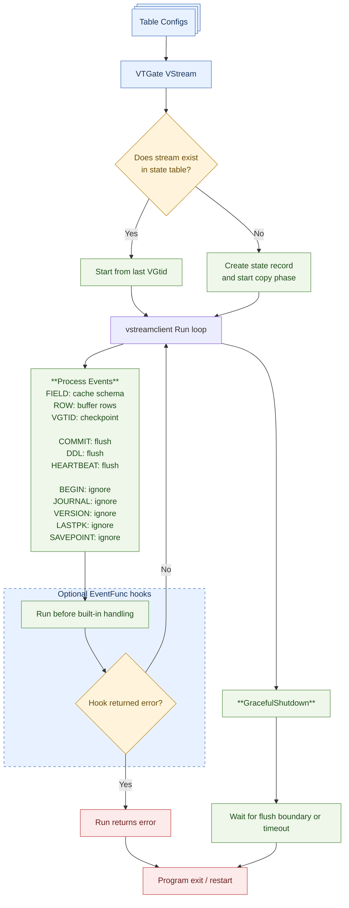
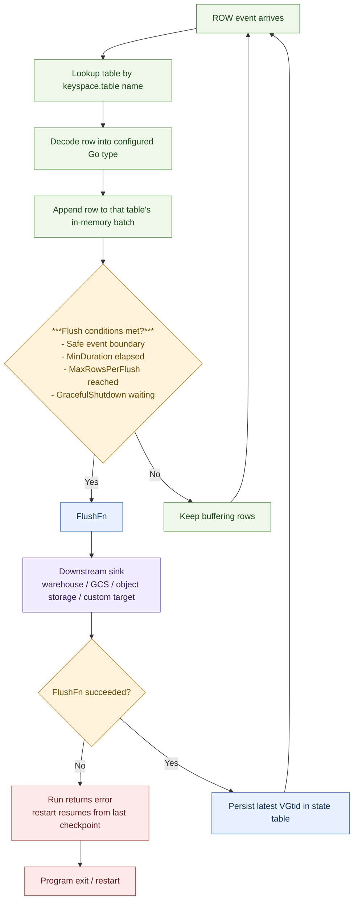

# vstreamclient

<!-- TOC -->
* [vstreamclient](#vstreamclient)
  * [Goals](#goals)
  * [Non-Goals](#non-goals)
  * [What It Does](#what-it-does)
  * [How It Works](#how-it-works)
    * [1. Configure tables](#1-configure-tables)
    * [2. Configure state](#2-configure-state)
    * [3. Run the stream](#3-run-the-stream)
    * [4. Flush buffered rows](#4-flush-buffered-rows)
    * [5. Persist checkpoints](#5-persist-checkpoints)
  * [Quick Start](#quick-start)
  * [Important Types](#important-types)
    * [`TableConfig`](#tableconfig)
    * [`Row`](#row)
    * [`FlushMeta`](#flushmeta)
  * [Struct Mapping](#struct-mapping)
  * [Custom Scanning](#custom-scanning)
  * [Common Usage Patterns](#common-usage-patterns)
    * [Single-table consumer](#single-table-consumer)
    * [Multi-table consumer](#multi-table-consumer)
    * [BigQuery via GCS](#bigquery-via-gcs)
    * [Same table name across keyspaces](#same-table-name-across-keyspaces)
    * [Event hooks](#event-hooks)
    * [Starting from a specific VGtid](#starting-from-a-specific-vgtid)
  * [Things To Watch Out For](#things-to-watch-out-for)
    * [`Run()` cannot be reused after shutdown](#run-cannot-be-reused-after-shutdown)
    * [Use `GracefulShutdown()` to stop safely](#use-gracefulshutdown-to-stop-safely)
    * [`FlushFn` errors stop the stream](#flushfn-errors-stop-the-stream)
    * [Event hook errors also stop the stream](#event-hook-errors-also-stop-the-stream)
    * [State table must be unsharded](#state-table-must-be-unsharded)
    * [Table configuration is part of state](#table-configuration-is-part-of-state)
    * [Copy interruption restarts from the beginning](#copy-interruption-restarts-from-the-beginning)
    * [Schema drift can be strict or tolerant](#schema-drift-can-be-strict-or-tolerant)
    * [`ReuseBatchSlice` changes ownership expectations](#reusebatchslice-changes-ownership-expectations)
    * [Bare table names are opt-in and can be dangerous](#bare-table-names-are-opt-in-and-can-be-dangerous)
  * [Recommended Patterns](#recommended-patterns)
  * [Limitations And Current Scope](#limitations-and-current-scope)
  * [Testing And Examples](#testing-and-examples)
  * [When To Use This Package](#when-to-use-this-package)
<!-- TOC -->

`vstreamclient` is a reference implementation for consuming Vitess VStream from Go.

It is meant to make VStream easier to use safely for common CDC-style workloads, especially when you want to turn
VStream events back into typed Go structs and send them somewhere else: a data warehouse, object storage, a search
index, a cache warmer, or a custom sink.

This package is intentionally semi-opinionated. It handles a number of correctness details for you, but it is still just
a client library. It does not require special Vitess internals, and it is not the only way to use VStream.

## Goals

These goals come from the original RFC for the package:

- provide a simple, production-ready way to consume VStream without deep VStream expertise
- translate VStream row events back into Go structs
- serve as a starting point for custom VStream consumers and connectors
- document important edge cases, gotchas, and recommended patterns

## Non-Goals

- it is not required in order to use VStream
- it is not tied to any specific warehouse, sink, or export target
- it does not require special server-side privileges or Vitess internals
- it is not a full CDC platform like Debezium, Kafka Connect, or Flink

## What It Does

At a high level, `vstreamclient`:

- creates a VStream with one or more table filters
- maps `FIELD` and `ROW` events into typed Go values
- buffers rows until a safe flush boundary
- calls your `FlushFn` with typed rows and metadata
- stores checkpoint state in a Vitess table that you own
- resumes from the last successful checkpoint on restart

The package is designed to be a practical base for building your own sink, not to decide where data goes after it leaves
Vitess.

**Overall Event Flow**



**Detailed Row Event Flow**



## How It Works

### 1. Configure tables

You provide one or more `TableConfig` values. Each one tells the client:

- which keyspace and table to stream
- which query to use for copy/filtering
- which Go type rows should be decoded into
- which function should handle flushed rows

If `Query` is empty, the default is:

```sql
select * from `<table>`
```

### 2. Configure state

You must provide a state table with `WithStateTable(...)`.

The state table:

- must live in an unsharded keyspace
- is created automatically if needed
- stores:
    - stream name
    - latest VGtid
    - stored table configuration
    - whether the initial copy phase completed

### 3. Run the stream

`Run(ctx)` reads events until the context is canceled, the remote stream ends, or an error occurs.

`Run(ctx)` returns an error when:

- `Run()` is called after `GracefulShutdown(...)` already closed the client
- the VStream transport fails or ends unexpectedly
- the context is canceled or times out while the stream is still active
- an event hook returns an error
- table lookup or row decoding fails
- `FlushFn` returns an error
- updating checkpoint state in the state table fails

The client processes:

- `FIELD` events to learn schema
- `ROW` events to decode data
- `VGTID` events to track checkpoint position
- `COMMIT`, `DDL`, and `HEARTBEAT` events as safe flush boundaries

If you register hooks with `WithEventFunc(...)`, they run inside this same event loop before the built-in handling for
that event type. That means:

- a `FIELD` hook runs before schema metadata is cached for that table
- a `ROW` hook runs before the row is decoded and added to a batch
- a `VGTID` hook runs before the candidate checkpoint is updated
- a `COMMIT`, `DDL`, or `HEARTBEAT` hook runs before the built-in flush logic for that event

Because hooks run inline in the main loop, they should stay lightweight. Slow hooks directly delay stream progress,
batch flushing, and checkpoint advancement.

### 4. Flush buffered rows

Rows are buffered per table and flushed via your `FlushFn`.

Flushes happen when:

- `minFlushDuration` has elapsed and a safe boundary is reached
- a table reaches `MaxRowsPerFlush`
- `GracefulShutdown(...)` waits for the next safe boundary during shutdown

### 5. Persist checkpoints

After a successful flush, the client stores the latest VGtid. If your `FlushFn` returns an error, the checkpoint is not
advanced.

That means restart behavior is tied to successful flushes, not just received events.

## Quick Start

```go
package main

import (
	"context"
	"os"
	"syscall"
	"time"

	"vitess.io/vitess/go/vt/vtgate/vtgateconn"
	"vitess.io/vitess/go/vt/vstreamclient"
)

type Customer struct {
	ID    int64  `vstream:"id"`
	Email string `vstream:"email"`
}

func run(ctx context.Context, conn *vtgateconn.VTGateConn) error {
	client, err := vstreamclient.New(ctx, "customer-sync", conn, []vstreamclient.TableConfig{{
		Keyspace: "customer",
		Table:    "customer",
		DataType: &Customer{},
		FlushFn: func(ctx context.Context, rows []vstreamclient.Row, meta vstreamclient.FlushMeta) error {
			for _, row := range rows {
				customer := row.Data.(*Customer)
				_ = customer
			}
			return nil
		},
	}},
		vstreamclient.WithStateTable("commerce", "vstreams"),
		vstreamclient.WithMinFlushDuration(5*time.Second),
		vstreamclient.WithHeartbeatSeconds(1),
		vstreamclient.WithGracefulShutdownSignals(10*time.Second, os.Interrupt, syscall.SIGTERM),
	)
	if err != nil {
		return err
	}

	return client.Run(ctx)
}
```

## Important Types

### `TableConfig`

Important fields:

- `Keyspace`, `Table`: identify the table being streamed
- `Query`: the VStream rule filter used for copy and row selection
- `DataType`: the Go type rows should decode into
- `FlushFn`: called with buffered rows
- `MaxRowsPerFlush`: limits batch size and can force flushing
- `ReuseBatchSlice`: reuses the batch slice backing array across flushes
- `ErrorOnUnknownFields`: fails if stream fields do not map to your struct

> [!NOTE]
> `MaxRowsPerFlush` and `WithMinFlushDuration(...)` are workload-tuning knobs, not just convenience settings.
>
> `MaxRowsPerFlush` means up to that many rows can stay buffered in memory until a flush runs, so make sure the process 
> has enough memory for the table shape and batch size you choose. It can also help to align this number with the 
> destination system. For example, if you are loading into an OLAP database, you may want batches that produce files 
> near the destination's preferred size for load performance.
>
> A larger `WithMinFlushDuration(...)` trades freshness for the throughput gains of larger batches. A smaller 
> `WithMinFlushDuration(...)` reduces the blast radius of a failure, because a flush error means the stream restarts 
> from the last checkpoint.

### `Row`

Each flushed row includes:

- the raw `RowEvent`
- the specific `RowChange`
- the decoded `Data`

For insert/update/delete handling, inspect `RowChange`:

- insert: `Before == nil`
- delete: `After == nil`
- update: both are present

Delete rows still include decoded `Data`, built from the `Before` image.

### `FlushMeta`

Each flush also includes metadata:

- `Keyspace`
- `Table`
- per-table stats
- stream-wide stats
- latest VGtid at the flush boundary

## Struct Mapping

By default, rows are decoded into structs using reflection.

Field matching uses this order:

1. `vstream` tag
2. `db` tag
3. `json` tag
4. Go field name

Example:

```go
type Customer struct {
	ID       int64   `vstream:"id"`
	Email    string  `db:"email"`
	Nickname *string `json:"nickname"`
}
```

Additional mapping behavior:

- `vstream:"-"` ignores a field
- pointer fields are supported for nullable columns
- `vstream:"field_name,json"` enables JSON decoding into that field

Example:

```go
type Payload struct {
	Source string `json:"source"`
}

type EventRow struct {
	ID      int64    `vstream:"id"`
	Payload *Payload `vstream:"payload,json"`
}
```

## Custom Scanning

If reflection is not enough, implement `VStreamScanner`:

```go
type Customer struct {
	ID    int64
	Email string
}

func (c *Customer) VStreamScan(fields []*querypb.Field, row []sqltypes.Value, rowEvent *binlogdatapb.RowEvent, rowChange *binlogdatapb.RowChange) error {
	// custom decoding here
	return nil
}
```

If `DataType` implements `VStreamScanner`, that logic is used instead of reflection.

For more complex rows, `VStreamScan` lets you handle custom parsing, nullable fields,
and event-specific behavior in one place.

Example:

```go
type OrderStatus string

const (
	OrderStatusPending OrderStatus = "pending"
	OrderStatusPaid    OrderStatus = "paid"
)

type OrderMetadata struct {
	Source string `json:"source"`
	Note   string `json:"note"`
}

type Order struct {
	ID         int64
	CustomerID int64
	Status     OrderStatus
	Metadata   *OrderMetadata
	Deleted    bool
}

func (o *Order) VStreamScan(fields []*querypb.Field, row []sqltypes.Value, _ *binlogdatapb.RowEvent, rowChange *binlogdatapb.RowChange) error {
	for i, field := range fields {
		value := row[i]

		switch field.Name {
		case "id":
			id, err := value.ToInt64()
			if err != nil {
				return fmt.Errorf("scan id: %w", err)
			}
			o.ID = id

		case "customer_id":
			customerID, err := value.ToInt64()
			if err != nil {
				return fmt.Errorf("scan customer_id: %w", err)
			}
			o.CustomerID = customerID

		case "status":
			o.Status = OrderStatus(value.ToString())

		case "metadata":
			if value.IsNull() {
				o.Metadata = nil
				continue
			}

			b, err := value.ToBytes()
 			if err != nil {
 				return fmt.Errorf("scan metadata: %w", err)
 			}

			metadata := &OrderMetadata{}
			if err := json.Unmarshal(b, metadata); err != nil {
				return fmt.Errorf("scan metadata: %w", err)
			}
			o.Metadata = metadata
		}
	}

	// delete events use the Before image, so this is a convenient place to tag them.
	o.Deleted = rowChange.After == nil
	return nil
}
```

This approach is useful when:

- column names need custom mapping logic
- values need validation or conversion into enums or domain types
- JSON/blob columns need bespoke decoding
- delete events need special handling beyond the default struct mapping

## Common Usage Patterns

### Single-table consumer

Use one `TableConfig` with a typed `FlushFn`. This is the simplest CDC pipeline shape.

### Multi-table consumer

You can stream multiple tables in one client by passing multiple `TableConfig` entries. Each table keeps its own buffer
and stats, but checkpointing is coordinated at the stream level.

### BigQuery via GCS

One common pattern is:

- convert each flushed row into newline-delimited JSON
- write the batch to GCS
- start a BigQuery load job from that object

Example:

```go
type Customer struct {
	ID    int64  `json:"id"`
	Email string `json:"email"`
}


func makeBigQueryFlushFn(gcsClient *storage.Client, bqClient *bigquery.Client, bucketName string) vstreamclient.FlushFunc {
	return func(ctx context.Context, rows []vstreamclient.Row, meta vstreamclient.FlushMeta) error {
		objectName := fmt.Sprintf(
			"vstream/%s/%s/%s/%d.jsonl",
			meta.Keyspace,
			meta.Table,
			meta.LatestVGtid.ShardGtids[0].Gtid,
			time.Now().UnixNano(),
		)

		bucket := gcsClient.Bucket(bucketName)
		writer := bucket.Object(objectName).NewWriter(ctx)
		writer.ContentType = "application/x-ndjson"

		encoder := json.NewEncoder(writer)
		for _, row := range rows {
			customer := row.Data.(*Customer)
			payload := map[string]any{
				"id":         customer.ID,
				"email":      customer.Email,
				"deleted":    row.RowChange.After == nil,
				"keyspace":   meta.Keyspace,
				"table":      meta.Table,
				"vgtid":      meta.LatestVGtid.String(),
				"flushed_at": time.Now().UTC().Format(time.RFC3339Nano),
			}

			if err := encoder.Encode(payload); err != nil {
				_ = writer.Close()
				return fmt.Errorf("encode json row: %w", err)
			}
		}

		if err := writer.Close(); err != nil {
			return fmt.Errorf("upload batch to gcs: %w", err)
		}

		gcsRef := bigquery.NewGCSReference(fmt.Sprintf("gs://%s/%s", bucketName, objectName))
		gcsRef.SourceFormat = bigquery.JSON

		loader := bqClient.Dataset("analytics").Table("customers_raw").LoaderFrom(gcsRef)
		loader.WriteDisposition = bigquery.WriteAppend

		job, err := loader.Run(ctx)
		if err != nil {
			return fmt.Errorf("start bigquery load job: %w", err)
		}

		// This waits synchronously so the flush is only considered successful after
		// BigQuery accepts the load. You do not have to wait here; many pipelines
		// increase throughput by enqueueing the job and waiting elsewhere.
		status, err := job.Wait(ctx)
		if err != nil {
			return fmt.Errorf("wait for bigquery load job: %w", err)
		}
		if err := status.Err(); err != nil {
			return fmt.Errorf("bigquery load job failed: %w", err)
		}

		return nil
	}
}

func newCustomerSink(ctx context.Context, conn *vtgateconn.VTGateConn, gcsClient *storage.Client, bqClient *bigquery.Client, bucketName string) (*vstreamclient.VStreamClient, error) {
	tableConfig := vstreamclient.TableConfig{
		Keyspace:        "customer",
		Table:           "customer",
		MaxRowsPerFlush: 1000,
		DataType:        &Customer{},
		FlushFn:         makeBigQueryFlushFn(gcsClient, bqClient, bucketName),
	}

	return vstreamclient.New(ctx, "customer-bigquery-sync", conn, []vstreamclient.TableConfig{tableConfig},
		vstreamclient.WithStateTable("commerce", "vstreams"),
		// A longer flush window trades freshness for fewer load jobs. That can be a
		// good fit for BigQuery because load jobs have a daily quota.
		vstreamclient.WithMinFlushDuration(5*time.Minute),
		vstreamclient.WithHeartbeatSeconds(1),
	)
}
```

Things to keep in mind with this pattern:

- if `FlushFn` returns an error, the checkpoint is not advanced and the same rows will be replayed
- the load path should therefore be idempotent, or at least deduplicatable downstream
- waiting synchronously gives simpler correctness semantics, but lower throughput
- a longer `WithMinFlushDuration(...)` reduces load-job frequency, which helps with BigQuery's per-day load-job quota, but it also makes the data less real-time
- uploading to GCS and handing load-job execution to a worker queue often scales better

### Same table name across keyspaces

This package supports same-named tables across keyspaces.

By default, it keeps keyspace-qualified table names from VTGate:

- `customer.customer`
- `accounting.customer`

That is the default for a reason: it avoids ambiguity.

### Event hooks

Use `WithEventFunc(...)` to intercept specific event types before normal handling.

Hooks run synchronously in the main `Run()` loop, one event at a time. They are best suited for:

- metrics and logging
- tracing or debugging event order
- lightweight validation or guardrails
- small pieces of event-specific side logic

They are usually a poor fit for:

- long-running network calls
- heavy transformation work
- expensive synchronous writes to external systems
- anything that should happen after a flush boundary instead of before it

Example uses:

- logging `FIELD` or `DDL` events
- metrics
- debugging event order
- aborting on a specific event

If an event hook returns an error, `Run()` stops immediately and the default handling for that event does not run.
For example, if a `ROW` hook returns an error, that row is not decoded or buffered, and if a `COMMIT` hook returns an
error, the normal flush path for that commit does not run.

### Starting from a specific VGtid

Use `WithStartingVGtid(...)` to override any stored checkpoint and begin from a caller-supplied position.

This is useful for:

- replay
- recovery
- controlled backfills

## Things To Watch Out For

### `Run()` cannot be reused after shutdown

After `GracefulShutdown(...)` closes a client, do not call `Run()` on that same instance again. Create a new client for
the next run or restart.

### Use `GracefulShutdown()` to stop safely

`GracefulShutdown(wait)` asks an active `Run()` call to stop after the next safe flush boundary. If no safe boundary
arrives before `wait` expires, the client stops and buffered rows are replayed on the next startup.

Recommended pattern:

If you already want to shut down on OS signals, the client can manage that goroutine for you:

```go
client, err := vstreamclient.New(ctx, "customer-sync", conn, tables,
	vstreamclient.WithStateTable("commerce", "vstreams"),
	vstreamclient.WithGracefulShutdownSignals(10*time.Second, os.Interrupt, syscall.SIGTERM),
)
if err != nil {
	return err
}

return client.Run(ctx)
```

This pattern is convenient when your application already shuts down on OS signals. In general, keep the `Run(...)`
context separate from the shutdown signal source so the stream can finish its graceful shutdown path instead
of being canceled immediately.

### `FlushFn` errors stop the stream

If `FlushFn` returns an error:

- `Run()` returns that error
- checkpoint state is not advanced
- the next run resumes from the last successful flush

This is important for correctness, but it means your flush logic should be explicit about retry behavior.

### Event hook errors also stop the stream

`WithEventFunc(...)` is not fire-and-forget. Returning an error aborts the stream before normal processing for that
event.

### State table must be unsharded

`WithStateTable(...)` requires an unsharded keyspace. This package intentionally stores its state in a user-owned Vitess
table rather than in `_vt`.

### Table configuration is part of state

The client stores a simplified version of your table config in the state table and validates it on restart.

That means changing things like:

- keyspace
- table
- query

for an existing stream name will fail fast instead of silently drifting.

### Copy interruption restarts from the beginning

If the initial copy phase starts but does not reach the final aggregate `COPY_COMPLETED`, the next startup restarts the
copy phase from the beginning.

This is intentional. Resuming from a partial copy is unsafe.

### Schema drift can be strict or tolerant

By default, the package is tolerant enough for many schema changes.

If you set `ErrorOnUnknownFields: true`, the stream fails when a streamed field does not map to your struct. That is
useful for strict consumers, but it means schema changes must be coordinated carefully.

### `ReuseBatchSlice` changes ownership expectations

If `ReuseBatchSlice` is `true`, the backing array for the batch may be reused on later flushes.

That reduces allocations, but it means:

- you must copy anything you want to keep after `FlushFn` returns
- you should not retain the batch slice itself for later use

### Bare table names are opt-in and can be dangerous

If you explicitly set:

```go
WithFlags(&vtgatepb.VStreamFlags{
	HeartbeatInterval:           1,
	ExcludeKeyspaceFromTableName: true,
})
```

then VTGate emits bare table names instead of `keyspace.table`.

That is only safe when table names are unique across the streamed keyspaces. If multiple keyspaces stream the same table
name, the client will fail with an ambiguity error rather than guess.

## Recommended Patterns

- use one stable stream name per consumer pipeline
- store state in a dedicated unsharded keyspace/table
- keep `Query` as narrow as you reasonably can
- use typed structs rather than manual row decoding when possible
- copy data inside `FlushFn` if you use `ReuseBatchSlice`
- treat `FlushFn` as the durability boundary for your downstream system
- use event hooks for logging and metrics, not heavy business logic

## Limitations And Current Scope

This package intentionally does not try to solve everything.

Current limitations and design choices include:

- state is stored in Vitess, not an external coordinator
- checkpointing is stream-level, not per-table
- no built-in retry or backoff framework for flush failures
- no built-in destination connector implementations
- no special handling for resharding beyond what normal VStream already provides
- `FlushInTx` exists in `TableConfig`, but a SQL transaction is not currently exposed to `FlushFn`

## Testing And Examples

The best examples today are in the tests:

- package-level tests in `go/vt/vstreamclient/`
- end-to-end coverage in `go/test/endtoend/vstreamclient/`

Those tests cover:

- inserts, updates, and deletes
- checkpoint resume behavior
- copy interruption handling
- same table names across keyspaces
- multiple tables in one stream
- heartbeat flushing
- strict schema drift failures
- custom table-name flags

## When To Use This Package

Use `vstreamclient` when:

- you want a Go-native way to consume VStream
- you want typed row decoding
- you need a reference implementation that already handles common edge cases
- you are building a custom CDC/export pipeline and do not want a full external CDC stack

It may not be the right fit when:

- you need a full managed CDC ecosystem with connectors, schemas, and queues built in
- you want a cross-language platform instead of a Go library
- you need a completely unopinionated raw VStream consumer
