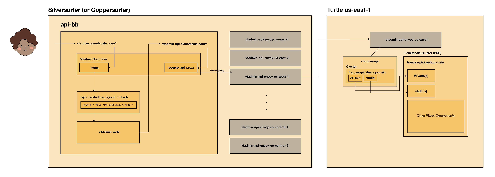

# VTAdmin at Planetscale
VTAdmin an open-sourced web UI and API that allows users to manage their Vitess clusters. At Planetscale, VTAdmin is deployed as two parts: VTAdmin API and VTAdmin Web.

VTAdmin currently lives at `vtadmin.planetscale.com`, but must be accessed via a button on a branch's page in the admin portal, i.e. `https://admin.planetscale.com/admin/organizations/frances/databases/broccoli-biscuits/branches/main`. This is because nececessary cookies and url parameters must be set from a branch's page before redirecting to vtadmin.

- **Internal Slack Channel**: planetscale/#project-vtadmin 
- **Open Source Slack Channels**
    - **Public**: vitess/#feat-vtadmin
    - **Private**: vitess/#vtadmin
- **Internal Project**: https://app.shortcut.com/planetscale/epic/2332/vtadmin-planetscale?cf_workflow=500000050&ct_workflow=all
- **Open Source Project**: https://github.com/vitessio/vitess/projects/12

## Open Source
VTAdmin is an open-source project, a part of the Vitess project. As of May 2022, it will be GA. While there may not be a dedicated Planetscale engineer working on VTAdmin at all times, we will always be able to appreciate and use updates made to VTAdmin by the open-source community.
## Background & Context
### VTAdmin Web
VTAdmin web is deployed within API-BB so we can utilize the same authorization flows as the admin portal, which uses Doorkeeper to handle auth.
### VTAdmin API
VTAdmin was initially built to support a static list of clusters provided at initialization time, and also had a "list-all" structure, wherein resources across all clusters would be fetched at once.

While this works for many of our customers, this was non-ideal for Planetscale as we have thousands of Planetscale Clusters (PSCs), whose addresses change dynamically. 

We needed a solution to "filter down" to just one cluster at a time. While we explored different solutions, including dynamic cluster topology, we decided on **dynamic clusters** to help us use VTAdmin at Planetscale.
### Dynamic Clusters
Dynamic clusters are clusters whose configs are passed after VTAdmin is initialized, as opposed at initialization time. Dynamic cluster configurations can be passed in [gRPC metadata](https://github.com/grpc/grpc-go/blob/master/Documentation/grpc-metadata.md) or HTTP header cookies.

At Planetscale, VTAdmin API is [initialized *without*](https://github.com/planetscale/infra-config-kubernetes/blob/main/deploy/vtadmin-api/common/deployment.yaml#L30-L40) any clusters, and expects dynamic clusters to be passed via HTTP cookie. 

Basic configuration for a dynamic cluster often looks like:
```
{
    "id": "dynamic",
    "name": "my-dynamic-cluster",
    "discovery": "dynamic",
    "discovery-dynamic-discovery": "{\"vtctlds\": [ { \"host\": { \"fqdn\": \"localhost:15000\", \"hostname\": \"localhost:15999\" } } ], \"vtgates\": [ { \"host\": {\"hostname\": \"localhost:15991\" } } ] }"
}
```

Specifically, at Planetscale, a dynamic configuration for a PSC looks like:
```
{
    id: <organization.name>-<database.name>-<branch.public_id>,
    name: <organization.name>-<database.name>-<branch.public_id>,
    discovery: "dynamic",
    "discovery-dynamic-discovery": "
        {
            vtctlds: [{ host: { fqdn: "<vtctld.name>.user-data.svc.cluster.local:<vtctld.web_port>", hostname: "<vtctld.name>.user-data.svc.cluster.local:<vtctld.grpc_port>" } }],
            vtgates: [{ host: { hostname: "<vtgate.name>.user-data.svc.cluster.local:<vtgate.grpc_port>" } }]
        }
    "
}
```
where the addresses are the service addresses for a PSC's vtctld and vtgate deployments. Service data can be found in on a [branch's page](https://admin.planetscale.com/admin/organizations/frances/databases/broccoli-biscuits/branches/main/cluster) in the admin portal.

A real example of a configuration at Planetscale looks like:
```
{
  "id": "frances-broccoli-biscuits-xrfsqfx2m393",
  "name": "frances-broccoli-biscuits-xrfsqfx2m393",
  "discovery": "dynamic",
  "discovery-dynamic-discovery": "{\"vtctlds\":[{\"host\":{\"fqdn\":\"primary-4kk0cm3cul74-vtctld-927f2819.user-data.svc.cluster.local:15000\",\"hostname\":\"primary-4kk0cm3cul74-vtctld-927f2819.user-data.svc.cluster.local:15999\"}}],\"vtgates\":[{\"host\":{\"hostname\":\"primary-xrfsqfx2m393-vtgate.user-data.svc.cluster.local:15999\"}}]}"
}
```

## Infrastructure & Design
In order to access the PSCs, we deploy one VTAdmin API per turtle (region). VTAdmin Web is deployed with [api-bb](https://github.com/planetscale/api-bb/blob/main/package.json#L16) as an imported [NPM package](https://www.npmjs.com/package/@planetscale/vtadmin) in the Silversurfer cluster. As a consequence of this set up, we use Envoy to proxy requests from VTAdmin Web (in Silversurfer) to a target turtle's VTAdmin API.

The E2E VTAdmin process looks like:
1. A user accesses a branch's (PSC's) VTAdmin through the admin portal (`admin.planetscale.com` --> `vtadmin.planetscale.com`).
2. VTAdmin Controller sets the necessary cookies for VTAdmin web to work in API BB:
    - `cluster`: this is the dynamic cluster configuration cookie (see above)
    - `vtadmin_database_name`, `vtadmin_organization_name`, and `vtadmin_branch_name`: these are used so VTAdmin Controller knows which Planetscale branch the user is looking at
3. All API requests from `vtadmin.planetscale.com` are routed to `vtadmin-api.planetscale.com#reverse_proxy_api`.
4. VTAdmin Controller `#reverse_proxy_api` looks up the correct vtadmin-api-envoy address for the current branch, and proxies the request to the vtadmin-api-envoy.
5. `vtadmin-api-envoy` (in Silversurfer) forwards requests to its counterpart within the turtle.
6. `vtadmin-api-envoy` (in the turtle) forwards the request to vtadmin-api inside the same turtle.
7. `vtadmin-api` uses the `cluster` cookie to filter down the api's cluster set to just the target PSC.
8. Consequently, all API requests are fulfilled with only the filtered-down cluster set.
9. `vtadmin-api`'s response is returned downstream, all the way back to api-bb's VTAdmin Controller.
10. The response is rendered in VTAdmin Web at `vtadmin.planetscale.com`.



## Components
### VTAdmin Web
As mentioned before, VTAdmin Web is released as an NPM package that is imported by `api-bb`.
- **Repository**: https://github.com/planetscale/vitess-private/tree/latest/web/vtadmin
- **NPM Package**: https://www.npmjs.com/package/@planetscale/vtadmin
- **DNS Records**: https://github.com/planetscale/infra/blob/main/dns/config/planetscale.com.yaml#L203-L208
- **ACM Certs**: https://github.com/planetscale/infra/pull/873/files
- **API BB Usage**
    - **Controller**: https://github.com/planetscale/api-bb/blob/main/app/controllers/vtadmin/vtadmin_controller.rb
    - **Routes**: https://github.com/planetscale/api-bb/blob/main/config/routes.rb#L293-L310

### VTAdmin API Envoy
VTAdmin Envoy denotes two kinds of Envoys:
1. VTAdmin Envoy instances deployed in Silversurfer
2. VTAdmin Envoy instances deployed in the turtles (one per turtle, ex. one in us-east-1)
    - These are the "prod" envoys

Every Envoy instance in Silversurfer has a counterpart in a turtle.

- **Repository**: https://github.com/planetscale/infra-config-kubernetes/tree/main/deploy/vtadmin-api-envoy
- **Argo**
    - **Prod**: https://argocd.silversurfer.planetscale.net/applications?search=vtadmin-api-envoy-prod
    - **Silversurfer**: https://argocd.silversurfer.planetscale.net/applications?search=vtadmin-api-envoy-silversurfer

**Envoy Admin Page**

Envoy instances have admin pages that might come in handy for debugging. To access an admin page, port-forward to an envoy pod:
```
pskube silversurfer port-forward -n vtadmin-api service/vtadmin-api-envoy-us-east-1 8090:8090
```
and access it locally at localhost:8090. Admin pages are always located at port 8090 for VTAdmin Envoy pods.

**Logs**

To access logs for a VTAdmin Envoy pod:
```
pskube silversurfer logs -n vtadmin-api service/vtadmin-api-envoy-us-east-1
```
### VTAdmin API
VTAdmin API is deployed 1 per turtle (ex. 1 in us-east-1).
- **Repository**: https://github.com/planetscale/vitess-private/tree/latest/go/vt/vtadmin
- **Deployment**: https://github.com/planetscale/infra-config-kubernetes/tree/main/deploy/vtadmin-api/common
- **Images**: We use the [vitess-lite images.](https://console.cloud.google.com/artifacts/docker/planetscale-registry/us/prod/vitess%2Flite)
- **Argo**: https://argocd.silversurfer.planetscale.net/applications?labels=application%253Dvtadmin-api

**Access Pod**

Extra permissions are needed to access a pod inside a turtle. Follow steps 1-4 of Thanos instructions [here](https://github.com/planetscale/api-bb/blob/main/docs/production-thanos.md) to set up pskube permissions locally.

```
> pskube us-east-1 port-forward -n vtadmin-api service/vtadmin-api 14200:14200 // Port forward
> pskube us-east-1 logs -n vtadmin-api // Get logs
> pskube silversurfer exec -n vtadmin-api --stdin --tty vtadmin-api-envoy-us-east-1-c8569fcfc-dxcd5 -- /bin/bash // Exec onto pod
```

## Debugging
To debug VTAdmin, it would be useful to start at api-bb logs [here](https://grafana.silversurfer.planetscale.net/explore?orgId=1&left=%7B%22datasource%22:%22silversurfer-1-loki%22,%22queries%22:%5B%7B%22refId%22:%22A%22,%22expr%22:%22%7Bapp%3D%5C%22api-bb-api%5C%22%7D%20%7C%3D%20%5C%22vtadmin%5C%22%22,%22queryType%22:%22range%22%7D%5D,%22range%22:%7B%22from%22:%22now-1h%22,%22to%22:%22now%22%7D%7D).

If that doesn't work, figure out the region in which the PSC is deployed, and look at the logs for VTAdmin API deployed in that region. For example, [us-east-1](https://grafana.silversurfer.planetscale.net/explore?orgId=1&left=%7B%22datasource%22:%22loki-prod-aws-useast1-2%22,%22queries%22:%5B%7B%22refId%22:%22A%22,%22expr%22:%22%7Bapp%3D%5C%22vtadmin-api%5C%22%7D%20%22,%22queryType%22:%22range%22%7D%5D,%22range%22:%7B%22from%22:%22now-1h%22,%22to%22:%22now%22%7D%7D).
## Updating VTAdmin
VTAdmin can be updated periodically to the latest version on vitess-private. 

### VTAdmin API
To update VTAdmin API:
1. Search for the image you intend to update VTAdmin with [here](https://console.cloud.google.com/artifacts/docker/planetscale-registry/us/prod/vitess%2Flite).
2. Copy the image's tag.
3. Open a PR and replace [this line](https://github.com/planetscale/infra-config-kubernetes/blob/main/deploy/vtadmin-api/common/deployment.yaml#L23) with the new image's tag.
4. VTAdmin API is autosynced once the PR is merged. You can check progress in Argo [here](https://argocd.silversurfer.planetscale.net/applications?proj=&sync=&health=&namespace=&cluster=&labels=application%253Dvtadmin-api). 

### VTAdmin Web
To update VTAdmin Web:
1. Follow the steps outlined at [`web/vtadmin/planetscale-vtadmin.md`](https://github.com/planetscale/vitess-private/blob/latest/web/vtadmin/planetscale-vtadmin.md) to release a new version of `@planetscale/vtadmin`.
2. Open a PR against `api-bb` to update the version of `@planetscale/vtadmin` [here](https://github.com/planetscale/api-bb/blob/main/package.json#L16).
3. VTAdmin Web is automatically deployed once the PR is merged.


