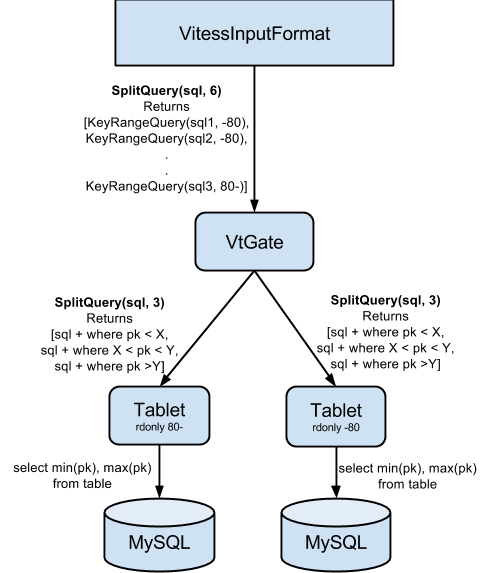

# Hadoop Integration

This package contains the necessary implementations for providing Hadoop support on Vitess. This allows mapreducing over tables stored in Vitess from Hadoop. 

Let's look at an example. Consider a table with the following schema that is stored in Vitess across several shards.

```
create table sample_table (
id bigint auto_increment,
name varchar(64),
keyspace_id bigint(20) unsigned NOT NULL,
primary key (id)) Engine=InnoDB;
```

Let's say we want to write a MapReduce job that imports this table from Vitess to HDFS where each row is turned into a CSV record in HDFS. 

We can use [VitessInputFormat](https://github.com/youtube/vitess/blob/master/java/hadoop/src/main/java/io/vitess/hadoop/VitessInputFormat.java), an implementation of Hadoop's [InputFormat](http://hadoop.apache.org/docs/stable/api/org/apache/hadoop/mapred/InputFormat.html), for that. With VitessInputFormat, rows from the source table are streamed to the mapper task. Each input record has a [NullWritable](https://hadoop.apache.org/docs/r2.2.0/api/org/apache/hadoop/io/NullWritable.html) key (no key, really), and [RowWritable](https://github.com/youtube/vitess/blob/master/java/hadoop/src/main/java/io/vitess/hadoop/RowWritable.java) as value, which is a writable implementation for the entire row's contents.

Here is an example implementation of our mapper, which transforms each row into a CSV Text. 

```java
public class TableCsvMapper extends
		Mapper<NullWritable, RowWritable, NullWritable, Text> {
	@Override
	public void map(NullWritable key, RowWritable value, Context context)
			throws IOException, InterruptedException {
		Row row = value.getRow();
		StringBuilder asCsv = new StringBuilder();
		asCsv.append(row.getInt("id"));
		asCsv.append(",");
		asCsv.append(row.getString("name"));
		asCsv.append(",");
		asCsv.append(row.getULong("keyspace_id"));
		context.write(NullWritable.get(), new Text(asCsv.toString()));
	}
}
```

The controller code for this MR job is shown below. Note that we are not specifying any sharding/replication related information here. VtGate figures out the right number of shards and replicas to fetch the rows from. The MR author only needs to worry about which rows to fetch (query), how to process them (mapper) and the extent of parallelism (splitCount).

```java
public static void main(String[] args) {
	Configuration conf = new Configuration();
	Job job = Job.getInstance(conf, "map vitess table");
	job.setJarByClass(VitessInputFormat.class);
	job.setMapperClass(TableCsvMapper.class);
	String vtgateAddresses = "localhost:15011,localhost:15012,localhost:15013";
	String keyspace = "SAMPLE_KEYSPACE";
	String query = "select id, name from sample_table";
	int splitCount = 100;
	VitessInputFormat.setInput(job, vtgateAddresses, keyspace, query, splitCount);
	job.setMapOutputKeyClass(NullWritable.class);
	job.setMapOutputValueClass(Text.class);
	...// set reducer and outputpath and launch the job
}
```

Refer [this integration test](https://github.com/youtube/vitess/blob/master/java/hadoop/src/test/java/io/vitess/hadoop/MapReduceIT.java) for a working example a MapReduce job on Vitess.

## How it Works

VitessInputFormat relies on VtGate's [SplitQuery](https://github.com/youtube/vitess/blob/21515f5c1a85c0054ddf7d2ff068702670ab93b5/proto/vtgateservice.proto#L98) RPC to obtain the input splits. This RPC method accepts a SplitQueryRequest which consists of an input query and the desired number of splits (splitCount). SplitQuery returns SplitQueryResult, which has a list of SplitQueryParts. SplitQueryPart consists of a KeyRangeQuery and a size estimate of how many rows this sub-query might return. SplitQueryParts return rows that are mutually exclusive and collectively exhaustive - all rows belonging to the original input query will be returned by one and exactly one SplitQueryPart.

VitessInputFormat turns each SplitQueryPart into a mapper task. The number of splits generated may not be exactly equal to the desired split count specified in the input. Specifically, if the desired split count is not a multiple of the number of shards, then VtGate will round it up to the next bigger multiple of number of shards.

In addition to splitting the query, the SplitQuery service also acts as a gatekeeper that rejects queries unsuitable for MapReduce. Queries with potentially expensive operations such as Joins, Group By, inner queries, Distinct, Order By, etc are not allowed. Specifically, only input queries of the following syntax are permitted.

```
select [list of columns] from table where [list of simple column filters];
```

There are additional constraints on the table schema to ensure that the sub queries do not result in full table scans. The table must have a primary key (simple or composite) and the leading primary key must be of one of the following types.
```
VT_TINY, VT_SHORT,  VT_LONG,  VT_LONGLONG,  VT_INT24,  VT_FLOAT,  VT_DOUBLE
```

#### Split Generation

Here's how SplitQuery works. VtGate forwards the input query to randomly chosen ‘rdonly’ vttablets in each shard with a split count, M = original split count / N, where N is the number of shards. Each vttablet parses the query and rejects it if it does not meet the constraints. If it is a valid query, the tablet fetches the min and max value for the leading primary key column from MySQL. Split the [min, max] range of into M intervals. Construct subqueries by appending where clauses corresponding to PK range intervals to the original query and return it to VtGate. VtGate aggregates the splits received from tablets and constructs KeyRangeQueries by appending KeyRange corresponding to that shard. The following diagram depicts this flow for a sample request of split size 6 on a cluster with two shards.



## Other Considerations

1. Specifying splitCount - Each split is a streaming query executed by a single mapper task. splitCount determines the number of mapper tasks that will be created and thus the extent of parallelism. Having too few, but long-running, splits would limit the throughput of the MR job as a whole. Long-running splits also makes retries of individual tasks failures more expensive as compared to leaner splits. On the other side, having too many splits can lead to extra overhead in task setup and connection overhead with VtGate. So, identifying the ideal split count is a balance between the two.

2. Joining multiple tables - Currently Vitess does not currently mapping over joined tables. However, this can be easily achieved by writing a multi-mapper MapReduce job and performing a reduce-side join in the MR job.

3. Views - Database Views are not great for full-table scans. If you need to map over a View, consider mapping over the underlying tables instead.


